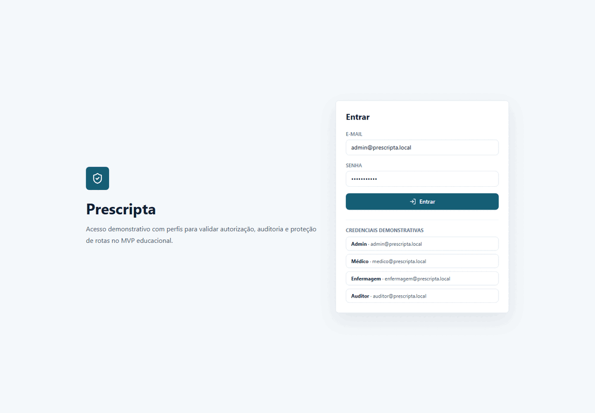
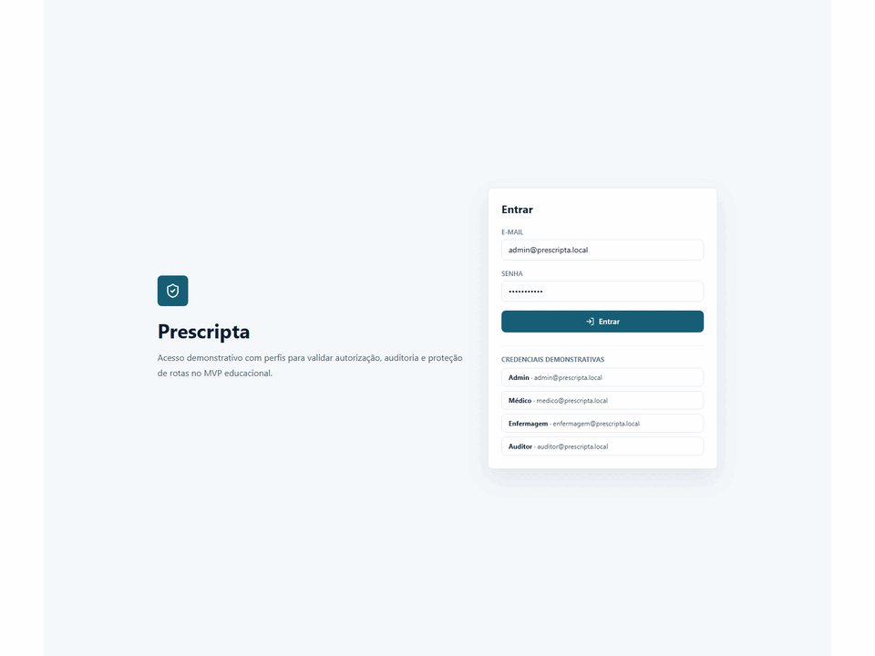
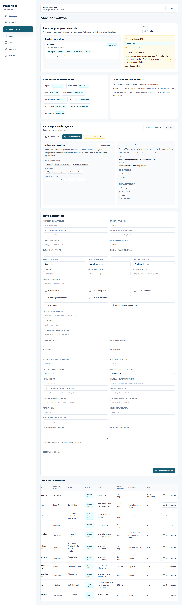
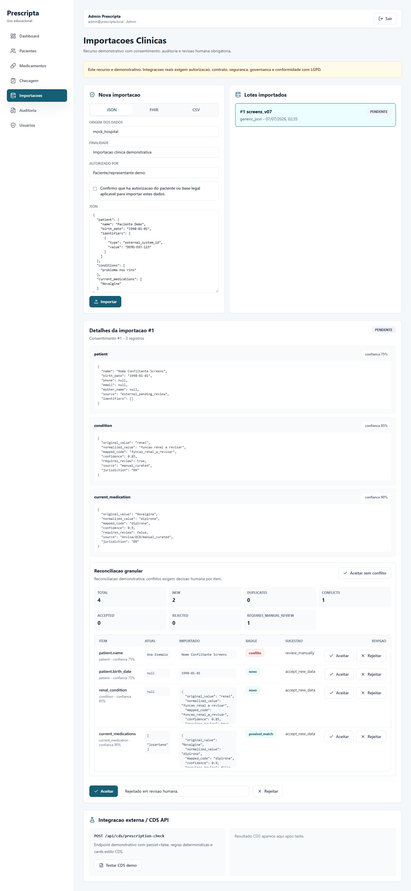

# Prescripta


Prescripta é um motor de apoio à prescrição segura com regras determinísticas,
evidências rastreáveis, revisão humana, IA explicativa e arquitetura preparada
para integração clínica.

> O Prescripta não é dispositivo médico validado e não substitui avaliação
> profissional. Não use dados reais de paciente neste projeto.

## Preview









## Funcionalidades

- Login JWT com perfis `admin`, `medico`, `enfermagem` e `auditor`.
- CRUD de pacientes com vocabulário clínico controlado.
- Catálogo farmacológico centrado em princípio ativo, DCB, aliases comerciais,
  fonte, jurisdição e status de validação.
- Motor determinístico de risco para alergia, dose, duração, dose acumulada,
  cautelas, interações, comorbidades e contexto clínico.
- Resumo prático de segurança por medicamento com fonte, jurisdição, evidência,
  cache e revisão humana.
- Perfil funcional do paciente para direção, máquinas, altura, quedas, álcool,
  turno noturno e atividades de alta atenção.
- Modo sem histórico com card de dados faltantes sem bloqueio automático.
- Reconciliação granular de importações clínicas FHIR/JSON/CSV com aceite ou
  rejeição por item.
- IA explicativa configurável por UI, com fallback determinístico e sem poder
  de alterar decisão clínica.
- Auditoria de ações clínicas, importações, reconciliação e configuração de IA.

## Configuração De IA Pela UI

Acesse **IA** no menu lateral.

Admin pode configurar:

- provider: `fallback`, `openai`, `gemini`, `ollama` ou `openai_compatible`;
- API Key;
- Base URL para Ollama ou providers OpenAI-compatible;
- modelo disponível ou modelo customizado;
- chamadas externas habilitadas/desabilitadas;
- teste de conexão;
- atualização da lista de modelos.

Médicos, enfermagem e auditores podem ver o status da IA, mas não visualizam nem
alteram a chave.

O frontend nunca chama OpenAI, Gemini, Ollama Cloud ou providers compatíveis
diretamente. A chave é enviada ao backend por endpoint autenticado e nunca é
salva em `localStorage`, nunca aparece em respostas da API e nunca é registrada
em logs.

Para persistir API Keys criptografadas, configure:

```env
PRESCRIPTA_CONFIG_ENCRYPTION_KEY=troque-esta-chave-local
```

Sem essa variável, o ambiente local usa armazenamento em memória para chaves
informadas pela UI. Em produção, persistir chave sem
`PRESCRIPTA_CONFIG_ENCRYPTION_KEY` retorna erro claro.

## Providers

- **fallback**: sempre disponível, sem chave, sem chamada externa.
- **OpenAI**: usa `OPENAI_API_KEY` ou chave salva pela UI.
- **Gemini**: usa `GEMINI_API_KEY`, `GOOGLE_API_KEY` ou chave salva pela UI.
- **Ollama**: usa `OLLAMA_BASE_URL`, padrão `http://localhost:11434`.
- **OpenAI-compatible**: usa Base URL, API Key e modelo customizado.

Modelos são listados pelo backend consultando o provider e mantidos em cache por
24 horas. Se a listagem falhar, o cache anterior é usado quando existir. Modelo
customizado precisa ser testado antes de ser ativado.

Se o provider externo falhar, o Prescripta cai para fallback local e não quebra
o fluxo clínico.

## Rodar Com Script Windows

```powershell
powershell -ExecutionPolicy Bypass -File scripts/start-prescripta.ps1
```

## Como Rodar Backend

```powershell
python -m venv .venv
.\.venv\Scripts\python -m pip install -r backend\requirements.txt
.\.venv\Scripts\python -m uvicorn app.main:app --reload --app-dir backend
```

Swagger: `http://localhost:8000/docs`

## Como Rodar Frontend

```powershell
cd frontend
npm install
npm run dev
```

Frontend: `http://localhost:5173`

## Credenciais De Exemplo

| Perfil | E-mail | Senha |
| --- | --- | --- |
| Admin | `admin@prescripta.local` | `Admin@12345` |
| Médico | `medico@prescripta.local` | `Medico@12345` |
| Enfermagem | `enfermagem@prescripta.local` | `Enfermagem@12345` |
| Auditor | `auditor@prescripta.local` | `Auditor@12345` |

## Testes E Lint

Backend:

```powershell
cd backend
ruff check . --no-cache
pytest
```

Frontend:

```powershell
cd frontend
npm run lint
npm run build
```

Qualidade textual:

```powershell
powershell -ExecutionPolicy Bypass -File scripts/check-text-quality.ps1
```

## Release Atual

- Publicada: `v0.7.1`
- Notas: [docs/releases/v0.7.1.md](docs/releases/v0.7.1.md)
- Configuração de IA: [docs/ai/provider-configuration.md](docs/ai/provider-configuration.md)
- Segurança de API Key: [docs/ai/secure-api-key-handling.md](docs/ai/secure-api-key-handling.md)
- Auditoria SafeDose/RicoToro: [docs/benchmark/safedose-parity-audit-v0.7.1.md](docs/benchmark/safedose-parity-audit-v0.7.1.md)

## Roadmap

- `v0.8.0`: relatórios, exportação e auditoria avançada.
- `v0.9.0`: Docker/PostgreSQL/deploy.
- `v1.0.0`: versão final de portfólio.

Se a lacuna de protocolos rápidos for priorizada, considerar `v0.8.x` para um
módulo de emergência validado por fonte/protocolo.

## Documentação

- [Visão geral da arquitetura](docs/architecture/overview.md)
- [Motor de risco](docs/clinical-rules/risk-engine.md)
- [Resumo prático de segurança](docs/clinical-rules/medication-counseling-summary.md)
- [Taxonomia de efeitos adversos](docs/clinical-rules/adverse-effect-taxonomy.md)
- [Configuração de provider IA](docs/ai/provider-configuration.md)
- [Seleção e atualização de modelos](docs/ai/model-selection-and-refresh.md)
- [Tratamento seguro de API Key](docs/ai/secure-api-key-handling.md)
- [Perfil funcional](docs/product/patient-functional-profile.md)
- [Modo sem histórico](docs/product/no-history-mode.md)
- [Importação clínica assistida](docs/interoperability/assisted-clinical-import.md)
- [Reconciliação clínica granular](docs/interoperability/clinical-reconciliation.md)
- [Fluxo de revisão humana](docs/interoperability/human-review-workflow.md)
- [Roadmap de protocolos rápidos](docs/product/emergency-protocols-roadmap.md)
