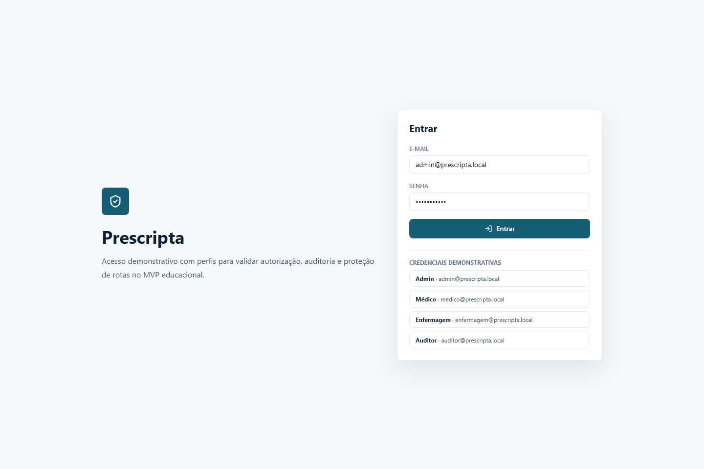
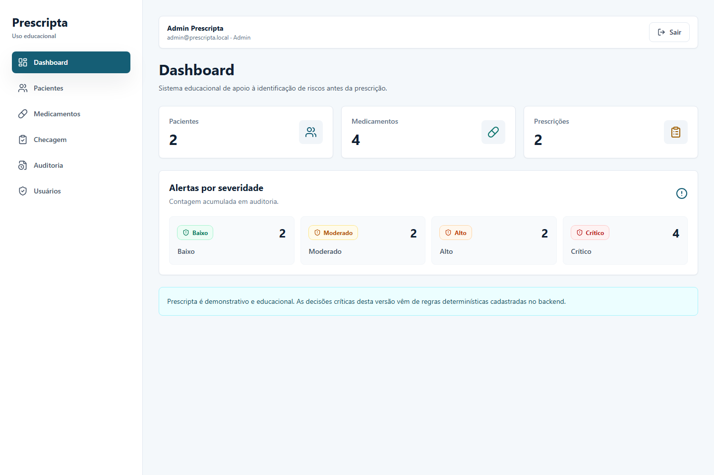
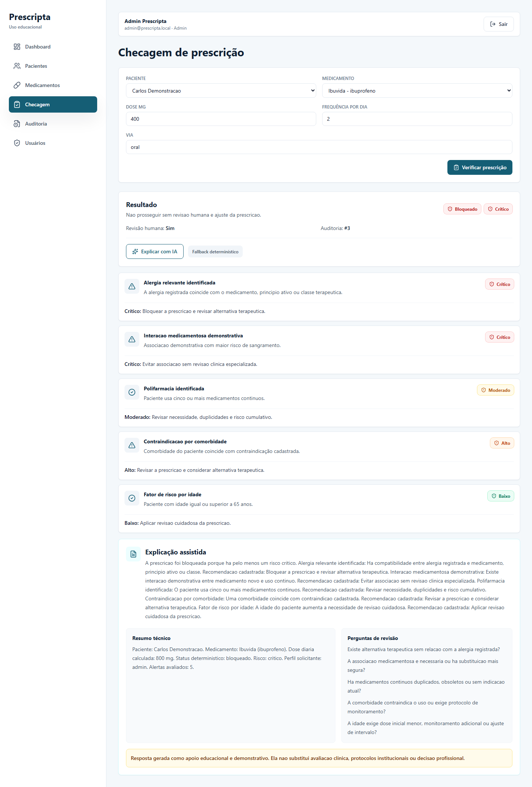
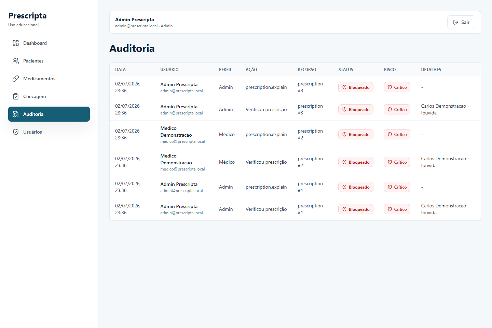
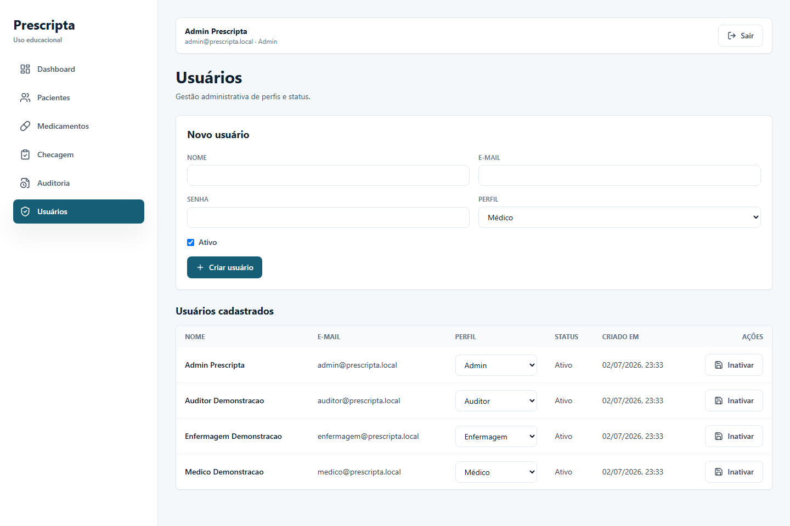

# Prescripta


Prescripta é um sistema web educacional de apoio à prescrição segura. O projeto demonstra como identificar riscos antes de uma prescrição usando regras determinísticas para alergias, interações medicamentosas, dose máxima, polifarmácia, contraindicações, vias inválidas e fatores do paciente.

> Uso educacional/demonstrativo: Prescripta não é dispositivo médico, não substitui avaliação profissional e não deve ser usado para decisões clínicas reais.

## Preview v0.3.0

### Fluxo demonstrativo


### Telas principais











## Funcionalidades

- Dashboard com contagem de pacientes, medicamentos, checagens e alertas por severidade.
- Login JWT com perfis `admin`, `medico`, `enfermagem` e `auditor`.
- CRUD básico de pacientes protegido por perfil.
- CRUD básico de medicamentos protegido por perfil.
- Checagem de prescrição com status, risco, alertas, recomendação e revisão humana.
- Motor de risco determinístico para alergia, dose máxima, interação, polifarmácia, idade, contraindicação e via.
- IA explicativa acionada manualmente para explicar alertas já calculados.
- Auditoria automática com usuário responsável em ações relevantes.
- Gestão de usuários para administradores.
- Seed demonstrativo para facilitar avaliação local.

## IA Explicativa

A v0.3.0 adiciona o endpoint `POST /api/prescriptions/explain` e o botão "Explicar com IA" na tela de checagem.

A IA:

- explica em linguagem simples por que a prescrição foi bloqueada ou exige atenção;
- gera resumo técnico;
- sugere perguntas de revisão clínica;
- informa o aviso educacional obrigatório;
- funciona em fallback determinístico sem chave de API.

A IA não:

- libera prescrição;
- calcula dose crítica sozinha;
- altera status, risco ou recomendação final;
- sobrescreve bloqueios críticos do motor determinístico.

Configuração opcional:

```powershell
PRESCRIPTA_AI_PROVIDER=fallback
PRESCRIPTA_AI_API_KEY=
PRESCRIPTA_AI_MODEL=gpt-5.5
```

Detalhes: [docs/ai/ai-explainer.md](docs/ai/ai-explainer.md)

## Arquitetura

O backend FastAPI concentra domínio, regras, autenticação, autorização, schemas, repositórios, banco SQLite e rotas. O frontend React consome a API real via Axios/React Query e não contém regra clínica.

```text
backend/app/domain       Entidades e enums de domínio
backend/app/services     Motor de risco, verificadores e IA explicativa
backend/app/repositories Persistência SQLAlchemy
backend/app/api/routes   Endpoints FastAPI
frontend/src/pages       Telas principais
frontend/src/components  Componentes reutilizáveis
docs                     Documentação modular
```

## Stack

- Frontend: React, TypeScript, Vite, TailwindCSS, React Router, Axios, React Query, React Hook Form, Zod.
- Backend: FastAPI, Pydantic, SQLAlchemy, SQLite, JWT, Argon2, OpenAI SDK opcional, Pytest, Ruff.
- Qualidade: Conventional Commits, changelog, roadmap, GitHub Actions, releases versionadas.

## Como Rodar Backend

```powershell
python -m venv .venv
.\.venv\Scripts\python -m pip install -r backend\requirements.txt
.\.venv\Scripts\python -m uvicorn app.main:app --reload --app-dir backend
```

Swagger: `http://localhost:8000/docs`

## Como Rodar Frontend

```powershell
cd frontend
npm install
npm run dev
```

Frontend: `http://localhost:5173`

## Credenciais Demonstrativas

As credenciais abaixo são apenas para ambiente local e dados fictícios.

| Perfil | E-mail | Senha |
| --- | --- | --- |
| Admin | `admin@prescripta.local` | `Admin@12345` |
| Médico | `medico@prescripta.local` | `Medico@12345` |
| Enfermagem | `enfermagem@prescripta.local` | `Enfermagem@12345` |
| Auditor | `auditor@prescripta.local` | `Auditor@12345` |

## Perfis De Usuário

- Admin: gerencia pacientes, medicamentos, usuários, checagens, auditoria e dashboard.
- Médico: gerencia pacientes, consulta medicamentos, verifica prescrições e vê dashboard.
- Enfermagem: consulta pacientes e medicamentos, verifica prescrições e vê dashboard.
- Auditor: vê dashboard e auditoria, sem criar ou editar registros.

## Segurança

- Senhas com hash Argon2 via `pwdlib`.
- Tokens JWT com `PRESCRIPTA_SECRET_KEY` e expiração configurável.
- Backend é a fonte real de autorização.
- Frontend armazena token em `localStorage` nesta versão demonstrativa.
- IA explicativa é protegida por perfil, acionada por clique e tem fallback local.

## Testes E Lint

Backend:

```powershell
cd backend
ruff check . --no-cache
pytest
```

Frontend:

```powershell
cd frontend
npm run lint
npm run build
```

## Release Atual

- Publicada: `v0.3.0`
- Notas: [docs/releases/v0.3.0.md](docs/releases/v0.3.0.md)
- Comparação conceitual: [docs/benchmark/safedose-comparison.md](docs/benchmark/safedose-comparison.md)
- Revisão de maturidade: [docs/product/maturity-review-v0.3.0.md](docs/product/maturity-review-v0.3.0.md)

## Roadmap Resumido

- `v0.1.0`: MVP de prescrição segura.
- `v0.2.0`: autenticação, perfis, segurança básica e auditoria com usuário.
- `v0.3.0`: IA explicativa, benchmark, maturidade e apresentação visual.
- `v0.4.0`: relatórios PDF, exportação, filtros de auditoria e testes end-to-end.
- `v0.5.0`: Docker, PostgreSQL, migrações e deploy.
- `v1.0.0`: versão demonstrável completa.

## Documentação

- [Visão geral da arquitetura](docs/architecture/overview.md)
- [Decisões de arquitetura](docs/architecture/decisions.md)
- [Visão de produto](docs/product/vision.md)
- [Roadmap de produto](docs/product/roadmap.md)
- [User stories](docs/product/user-stories.md)
- [Motor de risco](docs/clinical-rules/risk-engine.md)
- [IA explicativa](docs/ai/ai-explainer.md)
- [Comparação conceitual com SafeDose](docs/benchmark/safedose-comparison.md)
- [Revisão de maturidade v0.3.0](docs/product/maturity-review-v0.3.0.md)
- [Privacidade e LGPD](docs/security/privacy-and-lgpd.md)
- [Autenticação e perfis](docs/security/authentication-and-roles.md)
- [Threat model básico](docs/security/threat-model-basic.md)
- [Release v0.1.0](docs/releases/v0.1.0.md)
- [Release v0.2.0](docs/releases/v0.2.0.md)
- [Release v0.3.0](docs/releases/v0.3.0.md)
