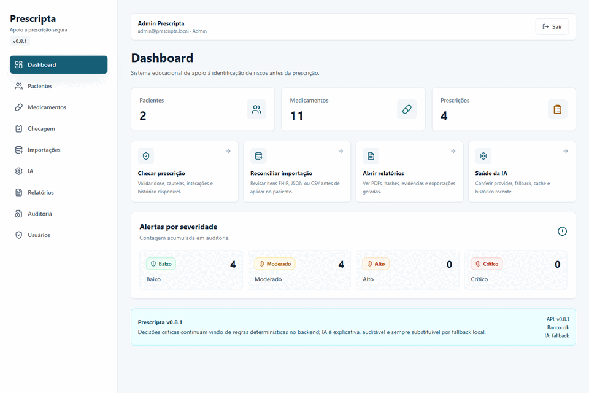
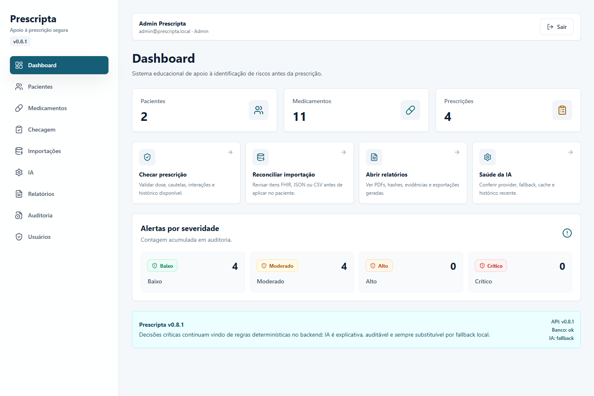
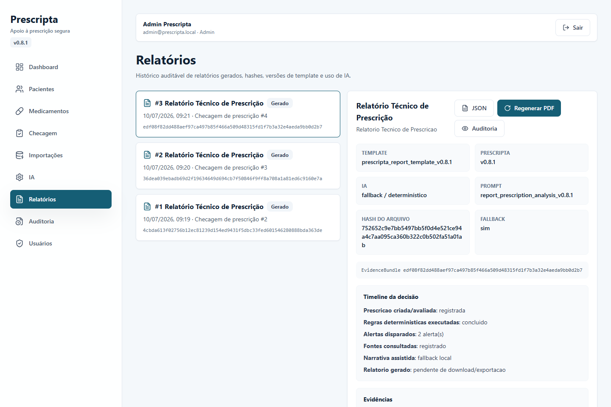
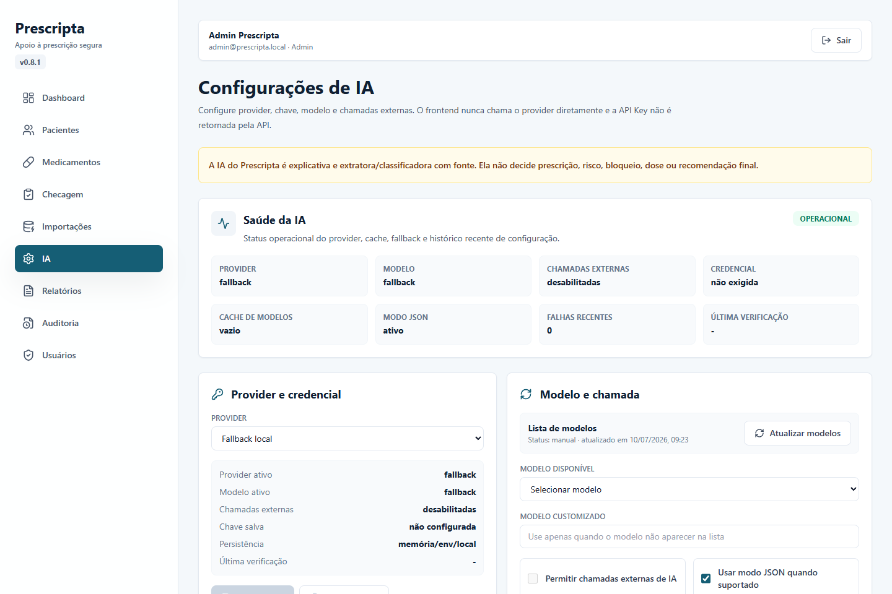

# Prescripta


Prescripta é uma plataforma educacional de apoio à prescrição segura. O projeto
combina regras determinísticas, catálogo centrado em princípio ativo, reconciliação
clínica assistida, relatórios auditáveis e IA explicativa com fallback local.

> Não é dispositivo médico validado e não substitui avaliação profissional, bula,
> protocolo institucional ou decisão clínica. Não use dados reais de paciente.

## Experiência









## O Que O Produto Faz

- Checa prescrições com regras determinísticas para dose, alergia, cautelas,
  interação, duração, dose acumulada e contexto clínico.
- Resolve medicamentos por princípio ativo, DCB e aliases comerciais brasileiros,
  incluindo casos como Novalgina, Anador, Dorflex, Neosaldina, Lisador e metamizol.
- Mantém perfil clínico e funcional do paciente, com modo sem histórico e avisos
  de dados faltantes sem bloqueio automático.
- Reconcilia importações FHIR, JSON e CSV item a item, com consentimento, auditoria,
  hash/máscara de identificadores e decisão humana antes de aplicar dados.
- Gera relatórios técnicos, orientações ao paciente, reconciliação e auditoria em
  PDF, preview, JSON e CSV, com hash do `ReportEvidenceBundle`.
- Configura IA por UI com provider, modelo, health panel, cache de modelos,
  retry/backoff, circuit breaker e fallback determinístico.

## Arquitetura Em Uma Linha

Backend FastAPI é a fonte de regra clínica, autorização e auditoria. Frontend React
orquestra a experiência. IA apenas explica, extrai ou resume conteúdo recuperado;
ela não altera risco, status, dose, bloqueio ou recomendação final.

## Rodar Localmente

```powershell
powershell -ExecutionPolicy Bypass -File scripts/setup-dev.ps1
powershell -ExecutionPolicy Bypass -File scripts/dev.ps1
```

URLs padrão:

- Frontend: `http://127.0.0.1:5173`
- API: `http://127.0.0.1:8000/api`
- Swagger: `http://127.0.0.1:8000/docs`
- Health: `http://127.0.0.1:8000/api/health`

Credenciais de exemplo:

| Perfil | E-mail | Senha |
| --- | --- | --- |
| Admin | `admin@prescripta.local` | `Admin@12345` |
| Médico | `medico@prescripta.local` | `Medico@12345` |
| Enfermagem | `enfermagem@prescripta.local` | `Enfermagem@12345` |
| Auditor | `auditor@prescripta.local` | `Auditor@12345` |

## Validação

```powershell
cd backend
..\.venv\Scripts\python -m ruff check . --no-cache
..\.venv\Scripts\python -m pytest
```

```powershell
cd frontend
npm run lint
npm run build
```

```powershell
powershell -ExecutionPolicy Bypass -File scripts/check-text-quality.ps1
```

## Documentação Principal

- [Getting started](docs/getting-started/local-setup.md)
- [Relatórios](docs/reports/README.md)
- [Configuração de IA](docs/ai/provider-configuration.md)
- [Registro de prompts](docs/ai/prompt-registry.md)
- [Reconciliação clínica](docs/interoperability/clinical-reconciliation.md)
- [Deduplicação e normalização](docs/data-quality/deduplication-and-normalization.md)
- [Auditoria SafeDose v0.8.1](docs/benchmark/safedose-parity-audit-v0.8.1.md)
- [Release v0.8.1](docs/releases/v0.8.1.md)
- [Roadmap](ROADMAP.md)

## Release Atual

`v0.8.1` foca prontidão de produto: UX, health de IA, hardening de provider,
deduplicação/reconciliação clínica, scripts locais, documentação e assets de
portfólio.
