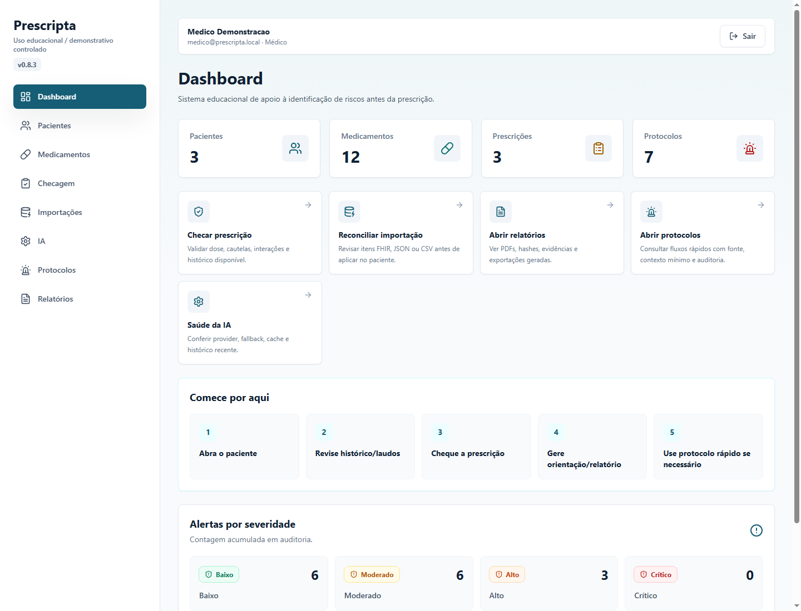
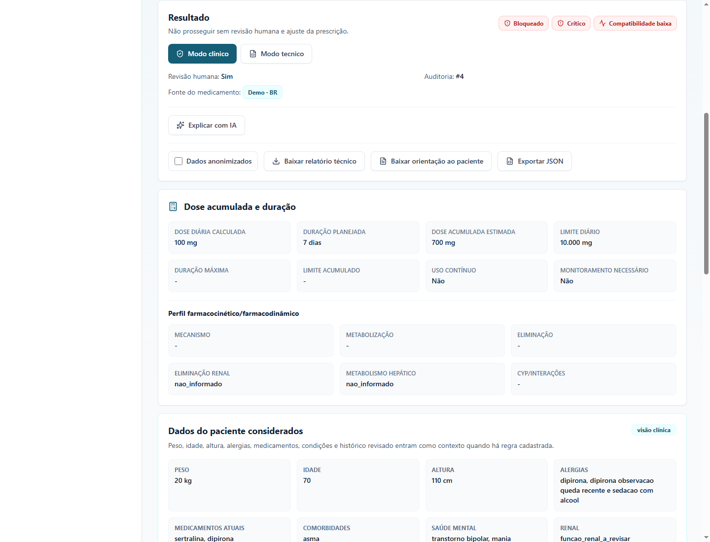
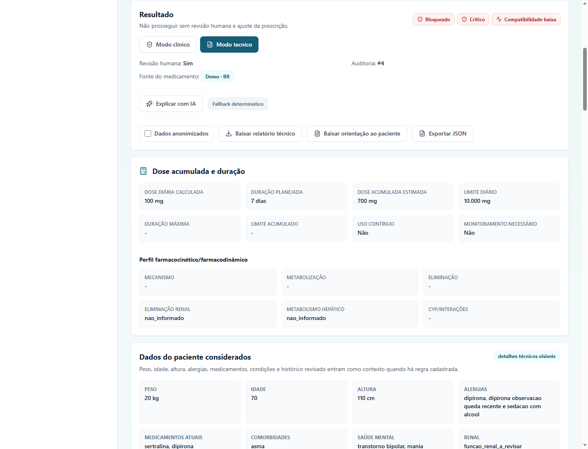
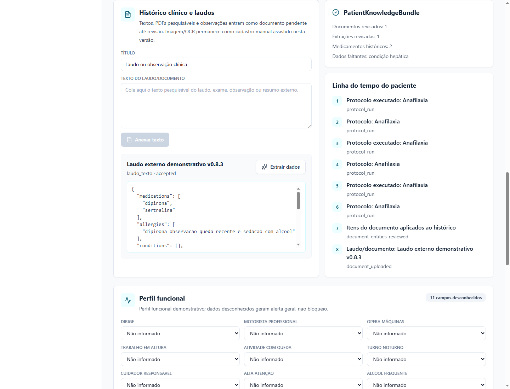
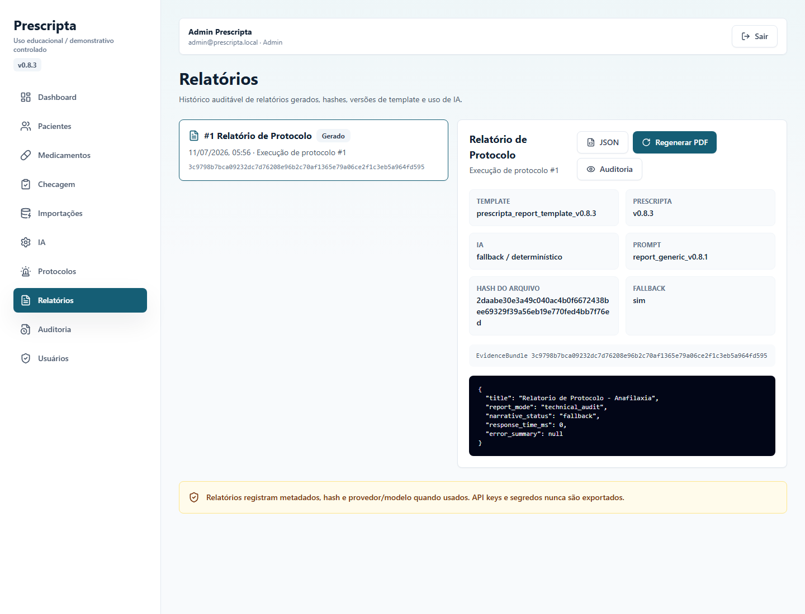

# Prescripta


O Prescripta é uma plataforma demonstrativa e educacional para checagem rastreável de
prescrições. Reúne contexto clínico, faixas de dose, sinais psicotrópicos, políticas
institucionais, orientações e auditoria sem delegar a decisão à inteligência artificial.

> **Aviso:** não é dispositivo médico, não está validado clinicamente e não substitui médico,
> farmacêutico, norma vigente, bula, protocolo institucional ou análise regulatória. Use apenas
> dados fictícios.

## Por que existe

Uma prescrição envolve mais do que comparar uma dose máxima: dados do paciente podem estar
ausentes, fontes mudam, regras têm forças diferentes e toda conclusão precisa ser revisável. A
v0.8.4 torna explícita a diferença entre permissão do sistema, credencial demo, recomendação
clínica, política institucional e regra legal/regulatória documentada.

## O que a v0.8.4 entrega

| Módulo | Entrega |
| --- | --- |
| Dose Intelligence | Fórmula, unidade, peso real/ideal/ajustado, IMC, superfície corporal, faixa e limites |
| Segurança psicotrópica | Sinais heurísticos de interação, sedação, QT, convulsão, mania e vulnerabilidades |
| Política de prescrição | Especialidade demo, tipo/força da política, fonte, receita e revisão humana |
| Histórico clínico | Dados estruturados, documentos, extrações revisadas e linha do tempo |
| Relatórios e auditoria | EvidenceBundle, hash, fonte, fallback, filtros e trilha de decisão |
| IA assistiva | Explica e extrai somente de fontes enviadas; nunca decide ou valida regras |

## Demonstração visual

### Dashboard


### Checagem clínica


### Dose Intelligence


### Segurança psicotrópica


### Política de prescrição


### Histórico e laudos


### Relatórios


## Fluxo rápido de teste

```powershell
python -m venv .venv
.\.venv\Scripts\python -m pip install -r backend\requirements.txt
cd frontend
npm install
npm run dev
```

Em outro terminal:

```powershell
cd backend
..\.venv\Scripts\python -m uvicorn app.main:app --reload
```

Abra `http://localhost:5173`, entre com uma conta demo, escolha paciente e medicamento e faça a
checagem. Alterne entre visão clínica e técnica para ver fontes, fórmulas e JSON auditável.

## Credenciais demo

| Perfil | E-mail | Senha |
| --- | --- | --- |
| Administrador | `admin@prescripta.local` | `Admin@12345` |
| Médico geral | `medico@prescripta.local` | `Medico@12345` |
| Anestesiologia | `anestesia@prescripta.local` | `Anestesia@12345` |
| Psiquiatria | `psiquiatria@prescripta.local` | `Psiquiatria@12345` |
| Auditoria | `auditor@prescripta.local` | `Auditor@12345` |
| Enfermagem | `enfermagem@prescripta.local` | `Enfermagem@12345` |

As credenciais clínicas são fictícias e exibidas como `demo_unverified`; a aplicação não consulta
CRM, CFM ou RQE.

## Configuração de IA

A configuração fica no backend e somente administradores podem salvar, testar, ativar ou apagar
uma chave. A chave nunca vai para `localStorage`, logs ou respostas. Sem chave — ou diante de falha
externa — o sistema preserva fallback determinístico. Prompts versionados ficam em
[`backend/app/ai/prompts`](backend/app/ai/prompts/).

## Arquitetura e documentação

- [Guia para leigos e avaliadores](docs/audiences/for-laypeople-and-evaluators.md)
- [Guia para médicos](docs/audiences/for-physicians.md)
- [Guia para enfermagem](docs/audiences/for-nursing.md)
- [Guia de auditoria](docs/audiences/for-auditors.md)
- [TI e integrações](docs/audiences/for-it-and-integrations.md)
- [Motor de dose](docs/clinical/dose-intelligence-engine.md)
- [Segurança psicotrópica](docs/clinical/psychotropic-safety-engine.md)
- [Política do prescritor](docs/clinical/prescriber-policy-engine.md)
- [Matriz de aceite](docs/product/v0.8.4-acceptance-matrix.md)

O backend FastAPI concentra autorização e regras determinísticas. React apresenta resultados, mas
não decide. Persistência usa SQLAlchemy; integrações seguem Ports & Adapters e os relatórios usam
bundles imutáveis com hash.

## Segurança e limites

- IA não altera risco, dose, bloqueio, protocolo, status ou recomendação final.
- Toda regra demo ou pendente exige revisão humana e mostra fonte/status.
- Fonte internacional é secundária quando há referência brasileira.
- Não há scraping agressivo, integração hospitalar real ou validação externa de CRM/RQE.
- CPF, CNS, contato e identificadores reais não devem ser enviados a provedores externos.

Consulte o [ROADMAP](ROADMAP.md), o [CHANGELOG](CHANGELOG.md) e as
[notas da v0.8.4](docs/releases/v0.8.4.md).

## Licença

Distribuído sob a [licença MIT](LICENSE).
