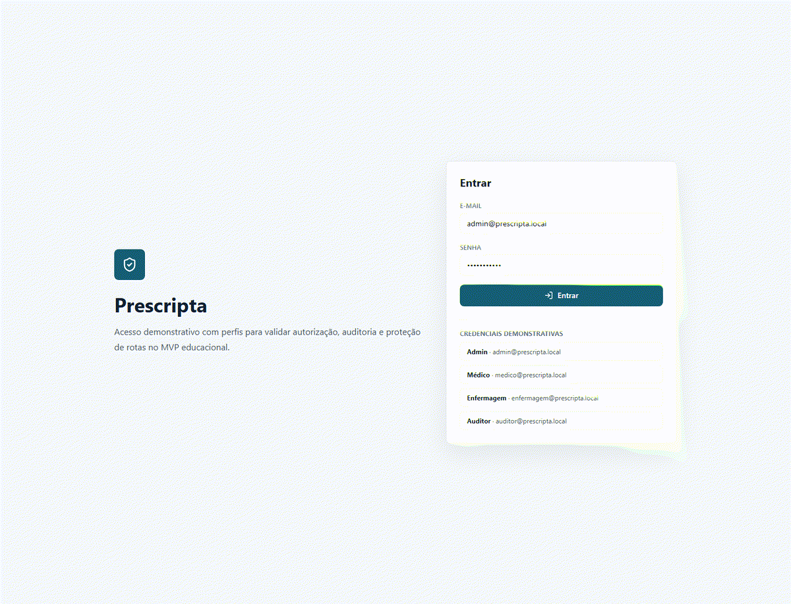
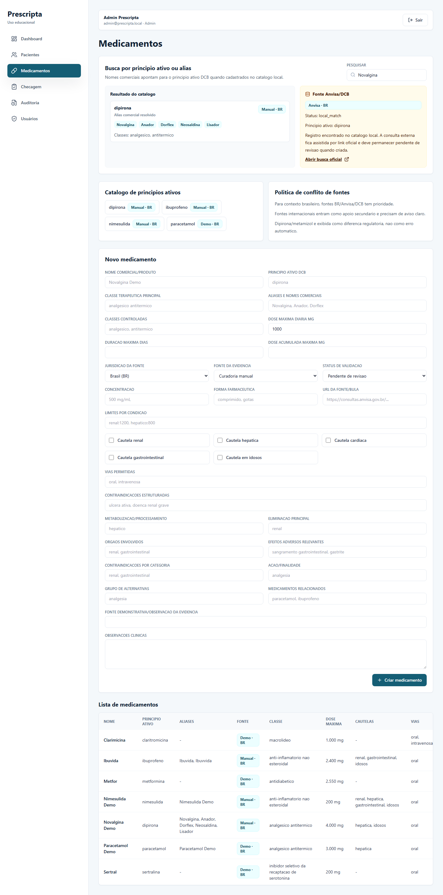
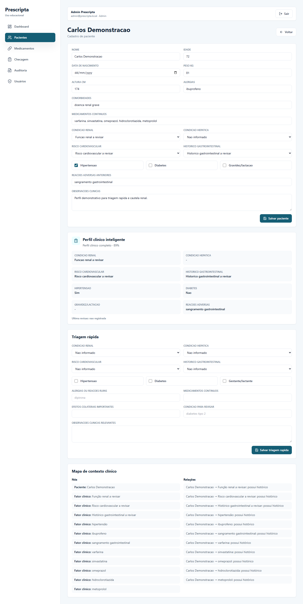
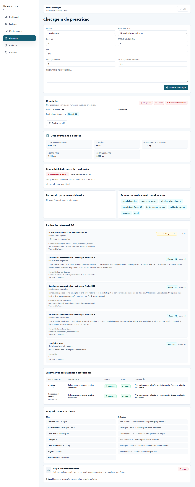

# Prescripta


Prescripta e um sistema web educacional de apoio a prescricao segura. A v0.5.0 profissionaliza a base farmacologica e clinica: principio ativo primeiro, aliases comerciais, fonte Brasil/Anvisa/DCB, vocabulario clinico controlado, RAG com metadados de fonte e IA apenas explicativa.

> Uso educacional/demonstrativo: Prescripta nao e dispositivo medico, nao substitui avaliacao profissional e nao deve ser usado para decisoes clinicas reais.

Prescripta e um motor de apoio a prescricao segura, preparado para integracao com sistemas clinicos via arquitetura de interoperabilidade, FHIR-like imports, adapters hospitalares, auditoria, consentimento e motor deterministico de risco.

## Preview v0.5.0










## Funcionalidades

- Login JWT com perfis `admin`, `medico`, `enfermagem` e `auditor`.
- CRUD de pacientes com vocabulario clinico controlado.
- Triagem rapida com selects estruturados e auditoria.
- Catalogo farmacologico centrado em `ActiveIngredient`.
- Produtos/aliases comerciais em `DrugProduct` e `MedicationModel` compativel com versoes anteriores.
- Busca por principio ativo ou nome comercial, como `Novalgina -> dipirona`.
- Fonte e jurisdicao: `BR`, `US`, `EU`, `GLOBAL`.
- Lookup assistido Anvisa/DCB sem scraping agressivo.
- Motor deterministico de risco para alergia, dose, duracao, dose acumulada, cautelas, interacoes, comorbidades e contexto clinico.
- RAG interno com `jurisdiction`, `source_name`, `source_url`, `evidence_type` e `validation_status`.
- IA explicativa multi-provider com fallback deterministico, sem poder de alterar decisao.
- Auditoria automatica de acoes relevantes.

## Fonte Brasil/Anvisa/DCB

A v0.5.0 prioriza:

- Anvisa/Bulario Eletronico;
- DCB como nomenclatura brasileira oficial;
- curadoria manual demonstrativa marcada por status.

openFDA, DailyMed, FDA e RxNorm podem ser considerados no futuro como fontes secundarias, nunca como regra primaria brasileira.

## Rodar Com Script Windows

```powershell
powershell -ExecutionPolicy Bypass -File scripts/start-prescripta.ps1
```

## Como Rodar Backend

```powershell
python -m venv .venv
.\.venv\Scripts\python -m pip install -r backend\requirements.txt
.\.venv\Scripts\python -m uvicorn app.main:app --reload --app-dir backend
```

Swagger: `http://localhost:8000/docs`

## Como Rodar Frontend

```powershell
cd frontend
npm install
npm run dev
```

Frontend: `http://localhost:5173`

## Credenciais Demonstrativas

| Perfil | E-mail | Senha |
| --- | --- | --- |
| Admin | `admin@prescripta.local` | `Admin@12345` |
| Medico | `medico@prescripta.local` | `Medico@12345` |
| Enfermagem | `enfermagem@prescripta.local` | `Enfermagem@12345` |
| Auditor | `auditor@prescripta.local` | `Auditor@12345` |

## Testes E Lint

Backend:

```powershell
cd backend
ruff check . --no-cache
pytest
```

Frontend:

```powershell
cd frontend
npm run lint
npm run build
```

## Release Atual

- Publicada: `v0.5.0`
- Notas: [docs/releases/v0.5.0.md](docs/releases/v0.5.0.md)
- Auditoria de profissionalizacao: [docs/product/professionalization-audit-v0.5.0.md](docs/product/professionalization-audit-v0.5.0.md)
- Fontes brasileiras: [docs/clinical-rules/brazilian-medication-sources.md](docs/clinical-rules/brazilian-medication-sources.md)

## Roadmap Resumido

- `v0.5.0`: Catalogo Brasil/Anvisa + principio ativo + vocabulario controlado.
- `v0.6.0`: Camada de Interoperabilidade Clinica / Ports & Adapters.
- `v0.7.0`: Importacao clinica assistida + FHIR Bundle + JSON/CSV.
- `v0.8.0`: Relatorios, exportacao e auditoria avancada.
- `v0.9.0`: Docker/PostgreSQL/deploy.
- `v1.0.0`: versao final de portfolio.

## Documentacao

- [Visao geral da arquitetura](docs/architecture/overview.md)
- [Decisoes de arquitetura](docs/architecture/decisions.md)
- [Modelo principio ativo primeiro](docs/clinical-rules/active-ingredient-first-model.md)
- [Fontes brasileiras de medicamentos](docs/clinical-rules/brazilian-medication-sources.md)
- [Vocabulario clinico controlado](docs/clinical-rules/controlled-clinical-vocabulary.md)
- [Motor de risco](docs/clinical-rules/risk-engine.md)
- [Estrategia Anvisa/DCB](docs/data/anvisa-dcb-import-strategy.md)
- [Politica de conflito de fontes](docs/data/source-conflict-policy.md)
- [IA explicativa](docs/ai/ai-explainer.md)
- [Roadmap de integracao clinica futura](docs/interoperability/future-clinical-integration-roadmap.md)
- [Privacidade e LGPD](docs/security/privacy-and-lgpd.md)
- [Threat model basico](docs/security/threat-model-basic.md)
