# Prescripta


Prescripta é uma plataforma educacional de apoio à prescrição segura. O projeto
combina regras determinísticas, catálogo farmacológico centrado em princípio
ativo, reconciliação clínica assistida, protocolos rápidos, relatórios
auditáveis e IA explicativa com fallback local.

> Prescripta não é dispositivo médico validado. Não substitui avaliação
> profissional, protocolo institucional, bula, regulação médica ou decisão
> clínica. Não use dados reais de paciente.

## Resumo Executivo

O objetivo do Prescripta é demonstrar, em um produto completo e testável, como um
sistema de saúde pode separar UI, API, regra clínica, IA e auditoria. O backend
continua sendo a fonte real de decisão e autorização; o frontend organiza a
experiência; a IA apenas explica, resume ou compõe texto a partir de evidência
rastreável.

A v0.8.2 adiciona a **Central de Protocolos Rápidos**, melhora a experiência
visual e transforma o README em um guia de produto, instalação e avaliação
técnica.

## Problema

Prescrições e fluxos clínicos costumam falhar por informação incompleta,
duplicidade, histórico fragmentado, baixa rastreabilidade e dependência de
explicações manuais. Em protótipos com IA, há ainda o risco de delegar decisões
críticas a modelos generativos.

Prescripta aborda esse problema com:

- regras determinísticas e testáveis;
- fonte, jurisdição e status de validação por medicamento/protocolo;
- revisão humana antes de aplicar dados importados;
- auditoria de checagens, relatórios, IA e protocolos;
- IA com escopo limitado e fallback determinístico.

## Para Quem Serve

- Avaliadores técnicos que querem ver arquitetura de produto healthtech.
- Desenvolvedores estudando FastAPI, React, auditoria e IA responsável.
- Profissionais e estudantes que precisam de um simulador educacional sem dados
  reais.
- Recrutadores analisando maturidade de produto, documentação e testes.

## Fluxo Principal

1. Entrar com usuário demo.
2. Revisar pacientes, perfil clínico e perfil funcional.
3. Consultar catálogo de medicamentos por princípio ativo ou alias comercial.
4. Simular checagem de prescrição.
5. Ler alertas, compatibilidade, orientação ao paciente e evidência RAG.
6. Reconciliar importações clínicas demonstrativas.
7. Gerar relatórios, exportações e timeline de auditoria.
8. Abrir Protocolos para fluxos rápidos com contexto mínimo e auditoria.
9. Verificar saúde/configuração da IA quando necessário.

## Abas Do Sistema

| Aba | Para Que Serve | Principais Ações |
| --- | --- | --- |
| Dashboard | Visão executiva do ambiente demo. | Métricas, atalhos, saúde da API/IA e versão. |
| Pacientes | Cadastro e revisão de perfil clínico. | Criar, editar, triagem rápida, identificadores e perfil funcional. |
| Medicamentos | Catálogo, princípios ativos e orientações práticas. | Buscar alias, revisar fonte, cadastrar regras e gerar resumo. |
| Checagem | Simulação determinística de prescrição. | Dose, duração, via, alergias, interações, RAG e orientação. |
| Importações | Revisão humana de dados FHIR/JSON/CSV. | Importar, comparar, aceitar/rejeitar item e exportar. |
| Relatórios | Histórico de relatórios e evidências. | Preview, PDF, JSON, timeline, hash e metadados de IA. |
| Protocolos | Fluxos rápidos demonstrativos de emergência. | Consultar, preencher contexto, executar, explicar, exportar. |
| Auditoria | Eventos de decisão e segurança. | Filtrar, abrir detalhe, timeline, evidência e PDF. |
| Usuários | Administração de contas demo. | Criar usuários e ajustar perfis. |
| Configurações > IA | Provider/modelo e saúde operacional. | Salvar credencial, listar modelos, testar conexão e ver fallback. |

## Central De Protocolos Rápidos

A v0.8.2 inclui sete protocolos demonstrativos:

- Anafilaxia.
- Parada cardiorrespiratória (PCR).
- Convulsão / crise convulsiva.
- Hipoglicemia.
- Dor torácica / suspeita de síndrome coronariana aguda.
- Broncoespasmo / crise asmática inicial.
- Intoxicação medicamentosa.

Cada protocolo tem fonte, jurisdição, status de validação, aviso educacional,
sinais de alerta, medidas imediatas, passos auditáveis, contexto mínimo,
evidência e pontos de julgamento humano. A execução gera evento de auditoria e
pode ser exportada em JSON/CSV ou renderizada como relatório PDF simples.

A IA pode explicar o racional do protocolo, mas não cria etapas, não altera dose,
não autoriza conduta e não inventa fonte.

## Como A IA É Usada

A IA é usada para:

- explicar alertas já gerados por regras determinísticas;
- extrair ou resumir conteúdo recuperado com fonte;
- compor narrativa de relatórios a partir de `ReportEvidenceBundle`;
- explicar protocolos rápidos sem alterar sua estrutura.

A IA não é usada para:

- decidir risco final;
- desbloquear prescrição;
- mudar dose crítica;
- criar contraindicação;
- inventar `source_id`;
- alterar dados importados;
- substituir revisão humana.

Quando provider externo falha, chamadas externas estão desabilitadas ou não há
credencial, o sistema usa fallback local.

## Segurança, LGPD E Auditoria

- API Key de IA fica no backend e nunca é retornada ao frontend.
- Apenas admin salva, remove, testa ou ativa provider/modelo.
- Médicos, enfermagem e auditoria podem ver status de IA sem visualizar chave.
- Identificadores importados aceitos são salvos com hash/máscara.
- Importações clínicas exigem consentimento e revisão humana.
- Relatórios e exportações registram hash e não incluem segredo.
- Protocolos rápidos registram execução e fonte em auditoria.
- Dados demo são artificiais; não use dados sensíveis reais.

## Arquitetura

```txt
frontend React + TypeScript
  -> cliente HTTP tipado
  -> rotas protegidas por perfil

backend FastAPI
  -> schemas Pydantic
  -> services determinísticos
  -> repositories SQLAlchemy
  -> auditoria e relatórios
  -> IA explicativa via AISettingsService

SQLite local demo
  -> seed artificial
  -> sem dados reais
```

O frontend pode esconder menus por perfil, mas a autorização real está no
backend.

## Stack

- Python 3.12, FastAPI, Pydantic, SQLAlchemy, Pytest e Ruff.
- React, TypeScript, Vite, TanStack Query, React Hook Form, Zod e Tailwind.
- SQLite local para demo.
- Providers de IA: fallback local, OpenAI, Gemini, Ollama e OpenAI-compatible.

## Instalação Rápida

```powershell
powershell -ExecutionPolicy Bypass -File scripts/setup-dev.ps1
powershell -ExecutionPolicy Bypass -File scripts/check-install.ps1
powershell -ExecutionPolicy Bypass -File scripts/dev.ps1
```

URLs padrão:

- Frontend: `http://127.0.0.1:5173`
- API: `http://127.0.0.1:8000/api`
- Swagger: `http://127.0.0.1:8000/docs`
- Health: `http://127.0.0.1:8000/api/health`

## Instalação Detalhada

```powershell
python -m venv .venv
.\.venv\Scripts\python -m pip install -r backend\requirements.txt
cd frontend
npm install
```

Crie `.env` a partir de `.env.example` se quiser alterar banco, CORS ou IA. Para
uso local com fallback, nenhuma chave externa é obrigatória.

## Rodar Backend

```powershell
cd backend
..\.venv\Scripts\python -m uvicorn app.main:app --reload
```

O backend cria o banco demo e popula dados artificiais quando `PRESCRIPTA_AUTO_SEED`
está habilitado.

## Rodar Frontend

```powershell
cd frontend
npm run dev
```

## Credenciais Demo

| Perfil | E-mail | Senha |
| --- | --- | --- |
| Admin | `admin@prescripta.local` | `Admin@12345` |
| Médico | `medico@prescripta.local` | `Medico@12345` |
| Enfermagem | `enfermagem@prescripta.local` | `Enfermagem@12345` |
| Auditor | `auditor@prescripta.local` | `Auditor@12345` |

## Primeiros 5 Minutos

1. Rode `scripts/setup-dev.ps1`.
2. Rode `scripts/dev.ps1`.
3. Entre como admin demo.
4. Abra Dashboard e confira a versão `v0.8.2`.
5. Vá em Medicamentos e busque `Novalgina`.
6. Faça uma checagem de prescrição.
7. Gere orientação ao paciente e relatório.
8. Importe um JSON demonstrativo e revise a reconciliação.
9. Abra Protocolos, execute Hipoglicemia ou Anafilaxia com contexto artificial.
10. Confira Auditoria e Configurações > IA.

## Configurar IA

Pela UI:

1. Entre como admin.
2. Abra **IA**.
3. Escolha provider.
4. Salve credencial ou Base URL quando aplicável.
5. Atualize modelos.
6. Teste conexão.
7. Ative modelo.

Pelo backend:

```env
PRESCRIPTA_AI_PROVIDER=fallback
PRESCRIPTA_AI_MODEL=
PRESCRIPTA_AI_ENABLE_EXTERNAL_CALLS=false
PRESCRIPTA_CONFIG_ENCRYPTION_KEY=troque-esta-chave-local
```

## Testes E Validação

```powershell
cd backend
..\.venv\Scripts\python -m ruff check . --no-cache
..\.venv\Scripts\python -m pytest
```

```powershell
cd frontend
npm run lint
npm run build
```

```powershell
powershell -ExecutionPolicy Bypass -File scripts/check-text-quality.ps1
```

## Screenshots

| Módulo | Captura |
| --- | --- |
| Dashboard | 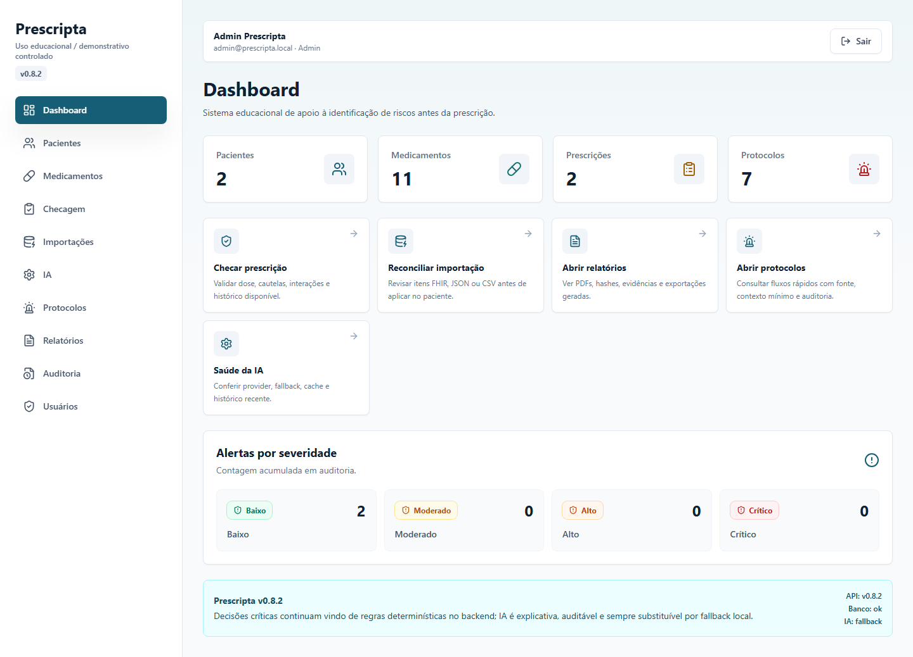 |
| Pacientes | 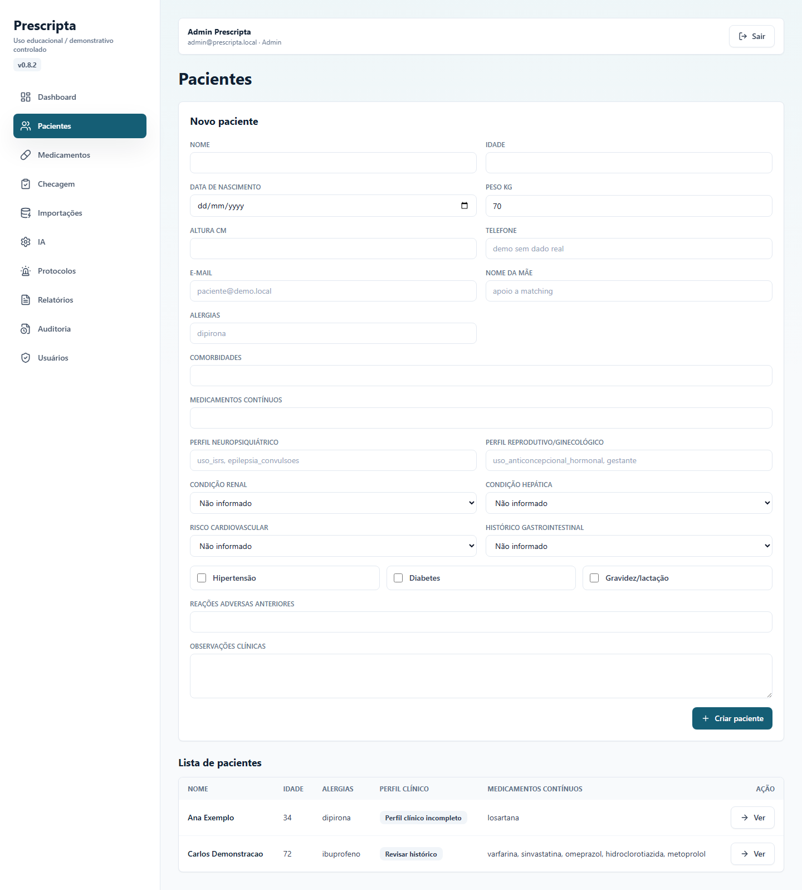 |
| Detalhe do paciente | 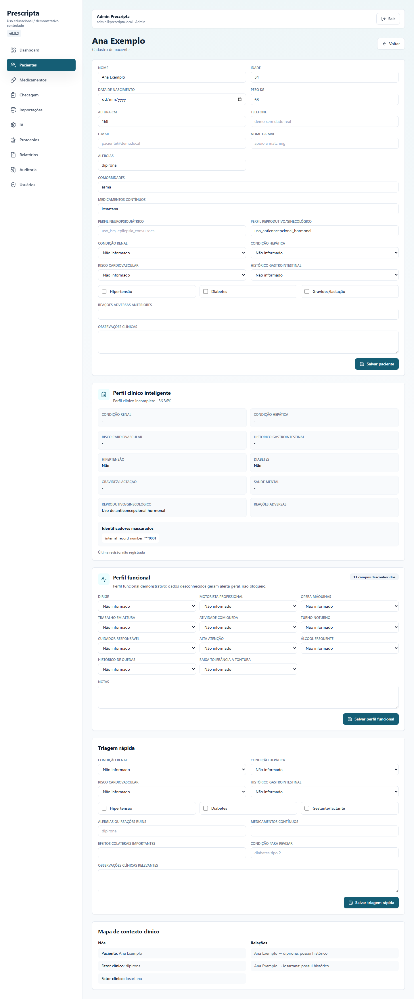 |
| Medicamentos | 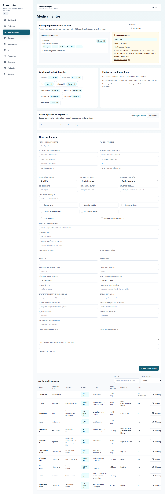 |
| Formulário de medicamento | 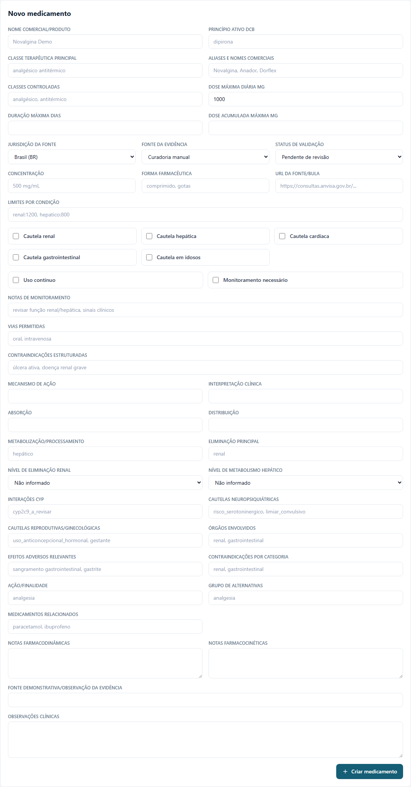 |
| Checagem | 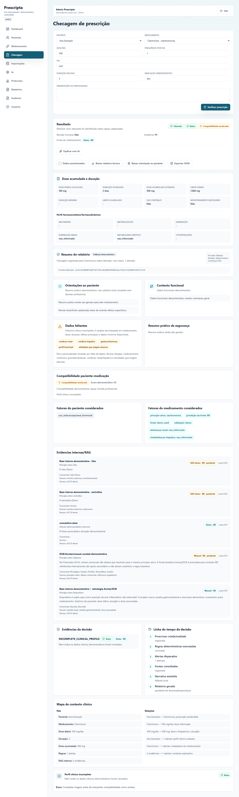 |
| Orientação ao paciente | 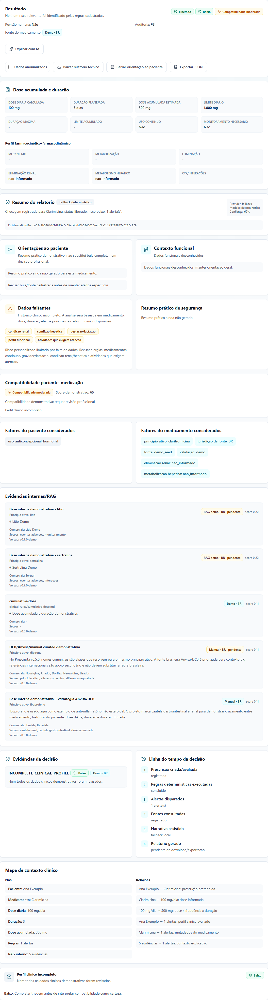 |
| Importações | 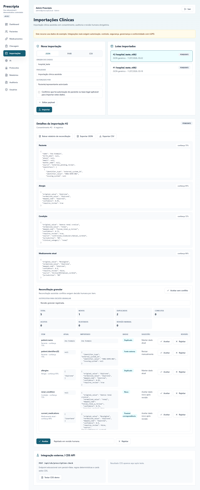 |
| Relatórios | 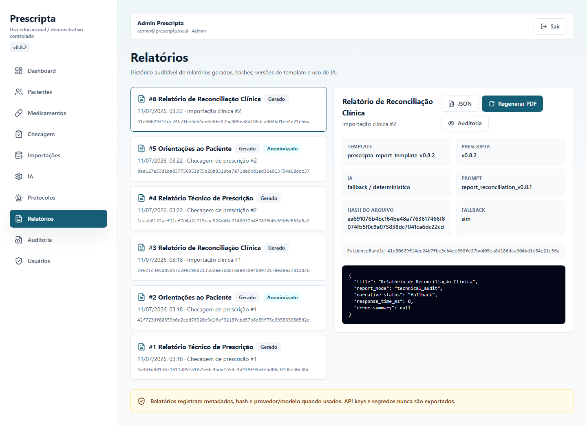 |
| Auditoria | 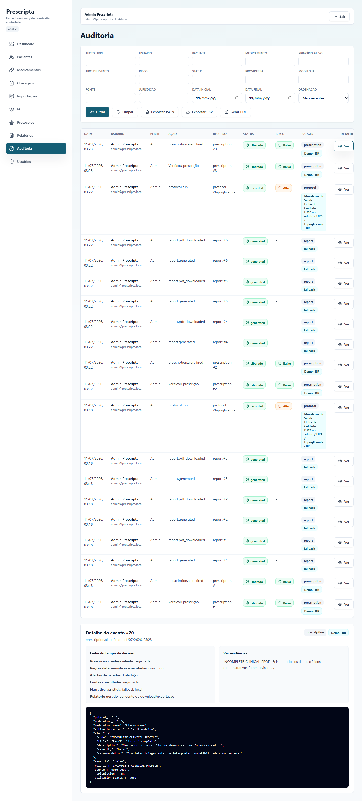 |
| IA | 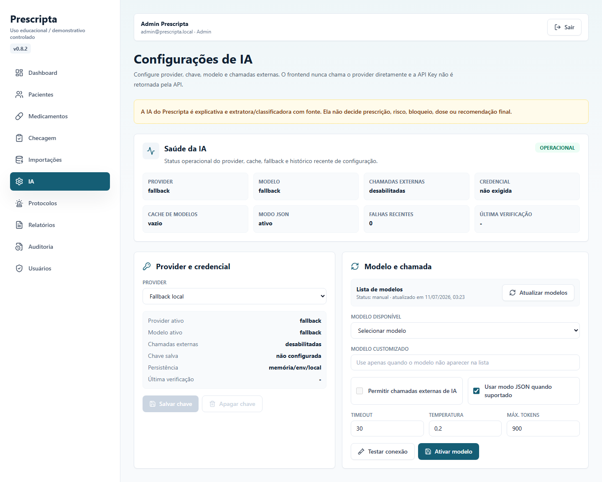 |
| Protocolos | 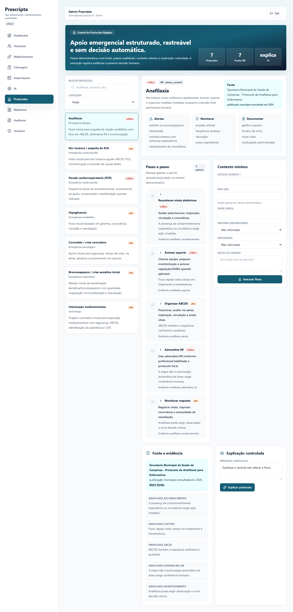 |
| Detalhe de protocolo | 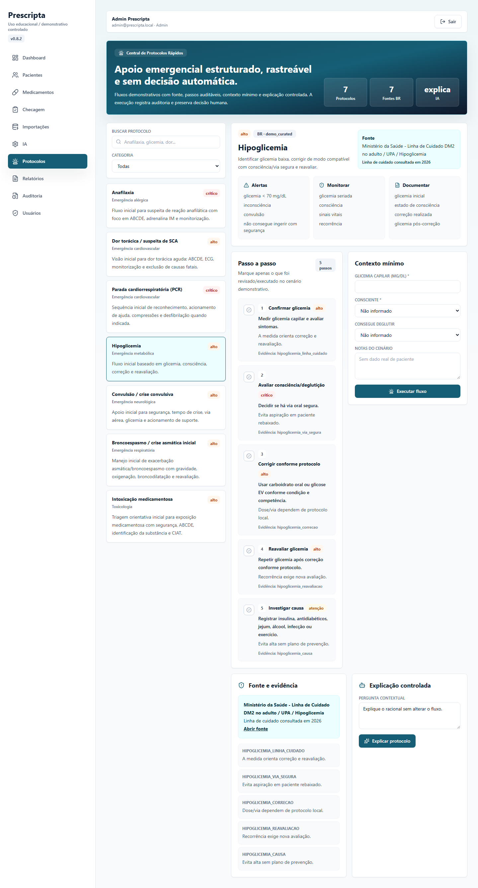 |
| Execução de protocolo | 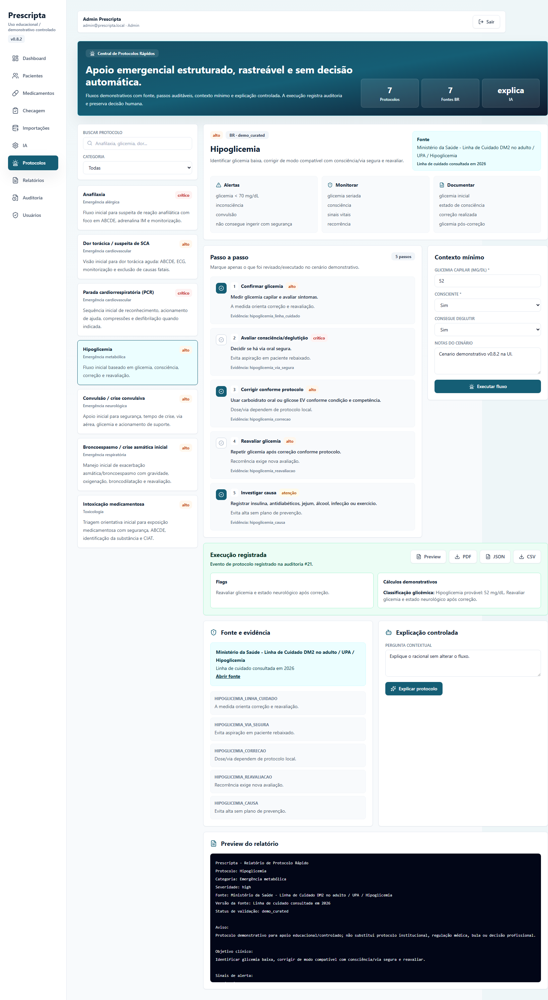 |
| Sidebar e versão | 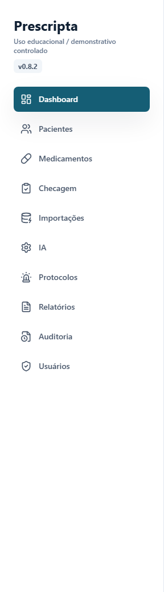 |
| Responsivo | 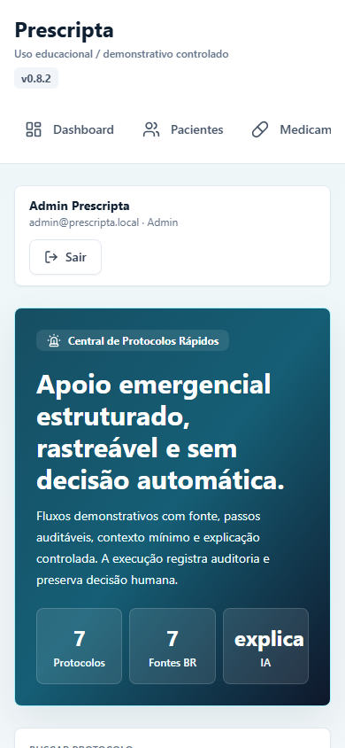 |

## GIFs

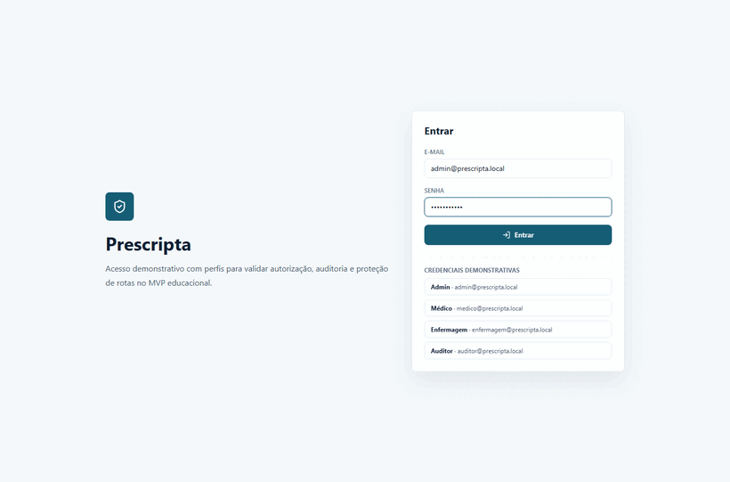

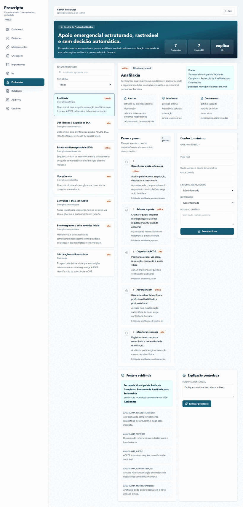

## Estrutura Do Repositório

```txt
backend/app/api/routes        Rotas FastAPI
backend/app/services          Regras determinísticas e serviços de aplicação
backend/app/reports           Relatórios, PDF simples, JSON/CSV e narrativa controlada
backend/app/integrations      Importação clínica, consentimento e reconciliação
backend/tests                 Testes unitários e de API
frontend/src/pages            Telas React
frontend/src/components       Componentes reutilizáveis
frontend/src/services         Cliente HTTP tipado
docs                          Arquitetura, produto, segurança, benchmark e releases
scripts                       Setup, dev, reset e qualidade textual
```

## Roadmap Resumido

- `v0.8.2`: protocolos rápidos, README forte, assets e polish visual.
- `v0.8.3`: ajustes finos de protocolos, UX e lacunas pequenas, se necessário.
- `v0.9.0`: Docker, PostgreSQL, migrações e deploy demo.
- `v1.0.0`: versão final de portfólio.

## Benchmark E Diferenciais

O benchmark SafeDose/RicoToro é usado apenas como comparação conceitual. Não há
cópia de código, layout, texto ou regra de terceiros. O Prescripta se diferencia
por backend/frontend separados, regras determinísticas testáveis, auditoria,
relatórios, reconciliação granular, IA limitada e agora protocolos rápidos com
fonte e execução auditada.

Documentos úteis:

- [Auditoria v0.8.2](docs/benchmark/safedose-parity-audit-v0.8.2.md)
- [Arquitetura de protocolos](docs/protocols/emergency-protocols-architecture.md)
- [Política de fontes](docs/protocols/protocol-source-policy.md)
- [Jornada inicial](docs/product/first-run-user-journey.md)
- [Troubleshooting](docs/setup/troubleshooting.md)

## Licença

Apache-2.0. Veja [LICENSE](LICENSE).
