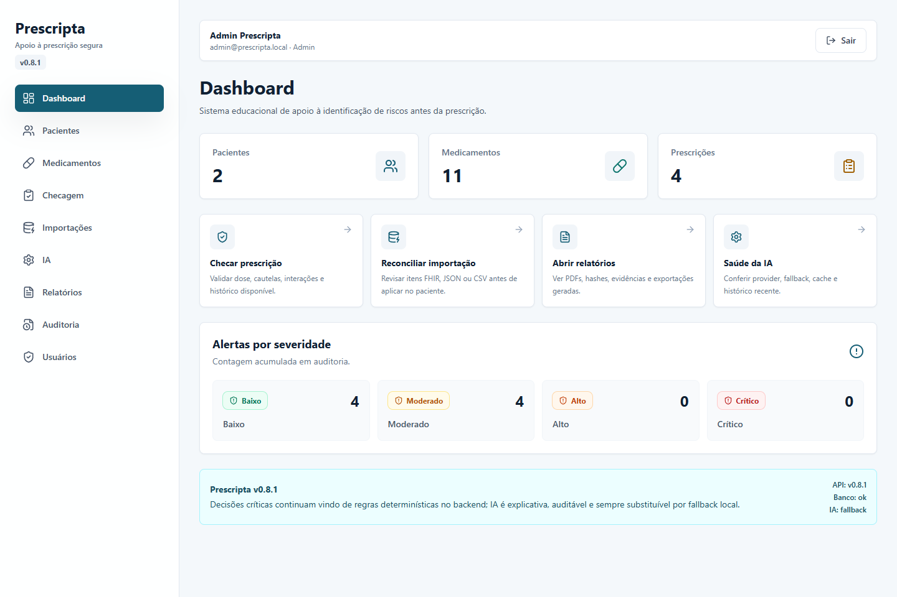

# Prescripta

[](https://github.com/Soturine/Prescripta/actions/workflows/ci.yml)
[](https://github.com/Soturine/Prescripta/actions/workflows/security.yml)
[](LICENSE)

O Prescripta é uma aplicação demonstrativa e educacional de segurança de medicamentos. Ela reúne
contexto fictício de paciente, conhecimento medicamentoso curado, regras determinísticas, cobertura,
revisão humana, relatórios e auditoria em uma interface FastAPI + React.

> Não é dispositivo médico, não possui validação clínica, regulatória ou institucional e não deve ser
> usado em atendimento real. Não substitui avaliação profissional, bula, protocolo, autoridade
> sanitária ou decisão institucional. Use somente dados fictícios.



## O que é — e o que não é

O projeto é uma base de portfólio e pesquisa para tornar explícitos os dados usados, os dados ausentes,
a vigência das fontes e a precedência entre achados. O backend é a fonte de autorização e da decisão.
IA opcional apenas explica snapshots já calculados ou extrai conteúdo recuperado, sempre com fallback
determinístico e revisão humana.

O projeto não implementa FHIR completo, SMART App Launch ou CDS Hooks. Os adapters de importação são
compatibilidade parcial e demonstrativa; não representam uma integração hospitalar certificada. A base
interna usa busca lexical indexada, não um RAG clinicamente validado.

## Capacidades

- envelope canônico de decisão com `coverage_status`, achados, fontes, dados faltantes e abstention;
- dose dimensional para massa, frequência, taxa, infusão, procedimento e exposição acumulada;
- catálogo demonstrativo com princípio ativo, produto, aliases, jurisdição, versão e status de revisão;
- autorização por instituição, escopo de paciente e trilha de acessos negados;
- snapshots clínicos imutáveis, hash de JSON canônico e relatórios históricos reprodutíveis;
- reconciliação granular de importações com consentimento e decisão humana por item;
- override governado sem reduzir severidade, com justificativa e segundo revisor independente;
- sessão em cookie HttpOnly, lockout persistente, MFA TOTP opcional e startup seguro fora do modo local;
- providers de IA opcionais com credenciais criptografadas, allowlist/SSRF, circuit breaker compartilhado
  e fallback local;
- PDF/JSON/CSV, paginação, manifesto de truncamento e auditoria pseudonimizada;
- Alembic, PostgreSQL em CI, testes automatizados, SAST/SCA, secret scan e SBOM.

## Instalação local

Requer Python 3.12+, Node.js 24+ e npm.

```powershell
python -m venv .venv
.\.venv\Scripts\python -m pip install -r backend\requirements.txt
.\.venv\Scripts\python -m pip install -r backend\requirements-dev.txt
cd frontend
npm ci
```

Copie `.env.example` para `.env` e mantenha o modo local enquanto usar SQLite, auto-seed e
credenciais demonstrativas. Em terminais separados:

```powershell
powershell -ExecutionPolicy Bypass -File scripts/dev.ps1
```

Ou consulte o [guia de setup local](docs/getting-started/local-setup.md).

## Arquitetura resumida

```text
React/TypeScript
      │ cookie HttpOnly + contratos tipados
FastAPI routes ── autorização por papel, instituição e objeto
      │
serviços de aplicação ── ClinicalDecisionOrchestrator ── regras determinísticas
      │                                      │
SQLAlchemy/Alembic                   busca lexical/IA explicativa
      │                                      │
PostgreSQL (produção alvo)            snapshots e fontes bloqueadas
```

Regras clínicas não ficam nas rotas nem no frontend. Uma checagem persiste decisão, eventos e snapshot
na mesma transação. Relatórios de prescrição leem apenas esse snapshot e verificam seu hash.

## Modo demo

O modo local cria dados artificiais quando `PRESCRIPTA_AUTO_SEED=true`. Credenciais demonstrativas,
SQLite, CORS local e o segredo padrão são rejeitados em ambientes não locais. O catálogo e as regras
seed permanecem marcados como `demo` ou `pending_review`; ausência de cobertura nunca aparece como
resultado favorável.

## Segurança e privacidade

- não versione `.env`, banco local, chaves, caches, `node_modules` ou `dist`;
- não envie CPF, CNS, contato, endereço ou identificadores reais a providers externos;
- nomes e e-mails não são copiados para novos eventos de auditoria;
- pseudonimização não é anonimização e continua sujeita a controle de acesso e retenção;
- produção exige PostgreSQL, segredo forte, auto-seed desligado, CORS explícito e chave de criptografia;
- vulnerabilidades devem seguir [SECURITY.md](SECURITY.md), não uma issue pública.

O [modelo de ameaça](docs/security/threat-model.md), o
[hazard log clínico](docs/security/clinical-safety-hazard-log.md) e os
[riscos aceitos](docs/security/accepted-risks.md) registram controles e risco residual.

## Documentação

- [índice da documentação](docs/README.md)
- [arquitetura](docs/architecture/overview.md)
- [regras clínicas](docs/clinical-rules/risk-engine.md)
- [interoperabilidade](docs/interoperability/architecture.md)
- [IA](docs/ai/multi-provider-ai.md) e [busca lexical](docs/rag/clinical-rag.md)
- [testes](docs/testing/ci-and-release-gates.md) e [operações](docs/operations/README.md)
- [auditorias históricas](docs/audits/README.md), [changelog](CHANGELOG.md) e
  [releases](docs/releases/v0.8.6.md)

## Testes

```powershell
cd backend
..\.venv\Scripts\python -m ruff check . --no-cache
..\.venv\Scripts\python -m pytest
cd ..\frontend
npm run lint
npm run typecheck
npm run test -- --run
npm run build
```

Os gates completos estão em `.github/workflows/ci.yml`, `.github/workflows/security.yml` e nos scripts
`scripts/check_*.py`.

## Licença

[Apache License 2.0](LICENSE). Fontes, padrões e projetos usados apenas como benchmark mantêm suas
próprias licenças; nenhum claim de conformidade é derivado deles.
