# Prescripta

[](https://github.com/Soturine/Prescripta/actions/workflows/ci.yml)
[](https://github.com/Soturine/Prescripta/actions/workflows/security.yml)
[](docs/releases/v0.10.0.md)
[](LICENSE)

O Prescripta é uma plataforma demonstrativa e educacional organizada em três pilares: Medication
Safety, Research & RWE e Evidence Intelligence. Ela reúne contexto fictício, regras determinísticas,
coortes agregadas, fontes rastreáveis, revisão humana, relatórios e auditoria em uma experiência
healthtech responsiva, disponível em PT-BR e EN-US.

> Não é dispositivo médico, não possui validação clínica, regulatória ou institucional e não deve ser
> usado em atendimento real. Não substitui avaliação profissional, bula, protocolo, autoridade
> sanitária ou decisão institucional. Use somente dados fictícios.

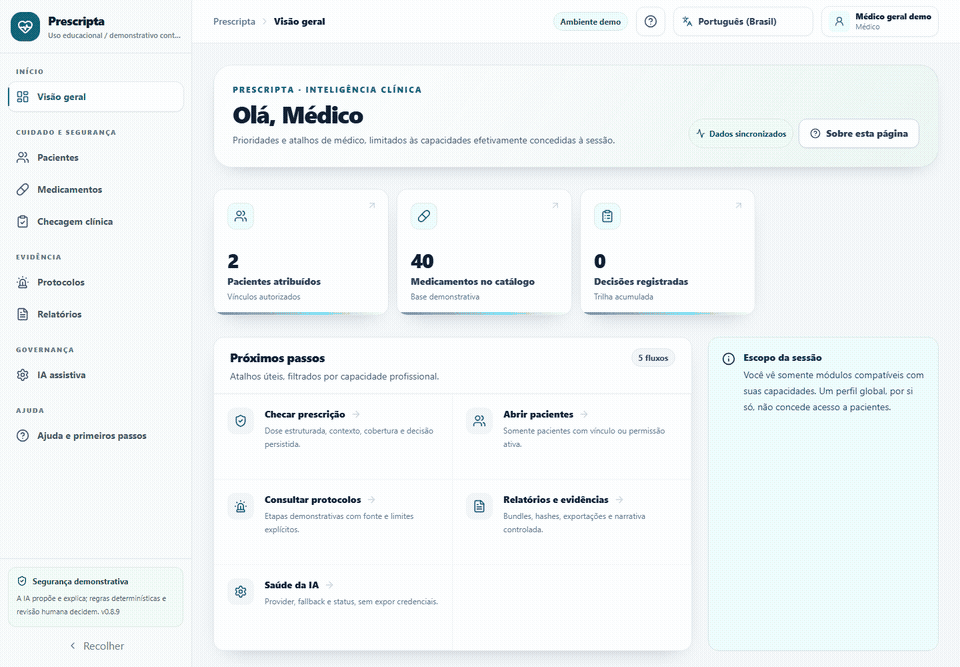

## O que é — e o que não é

O projeto é uma base de portfólio e pesquisa para tornar explícitos os dados usados, os dados ausentes,
a vigência das fontes e a precedência entre achados. O backend é a fonte de autorização e da decisão.
IA opcional apenas explica snapshots já calculados ou extrai conteúdo recuperado, sempre com fallback
determinístico e revisão humana.

O projeto implementa somente um subset delimitado de FHIR R4 JSON; não implementa FHIR completo,
SMART App Launch ou CDS Hooks. Os adapters de importação são compatibilidade parcial e demonstrativa;
não representam uma integração hospitalar certificada. A base
interna usa busca lexical indexada, não um RAG clinicamente validado.

## Capacidades

- envelope canônico de decisão com `coverage_status`, achados, fontes, dados faltantes e abstention;
- dose dimensional para massa, frequência, taxa, infusão, procedimento e exposição acumulada;
- catálogo demonstrativo com princípio ativo, produto, aliases, jurisdição, versão e status de revisão;
- autorização por instituição, escopo de paciente e trilha de acessos negados;
- snapshots clínicos imutáveis, hash de JSON canônico e relatórios históricos reprodutíveis;
- reconciliação granular de importações com consentimento e decisão humana por item;
- override governado sem reduzir severidade, com justificativa e segundo revisor independente;
- sessão em cookie HttpOnly, lockout persistente, MFA TOTP opcional e startup seguro fora do modo local;
- providers de IA opcionais com credenciais criptografadas, allowlist/SSRF, circuit breaker compartilhado
  e fallback local;
- PDF/JSON/CSV, paginação, manifesto de truncamento e auditoria pseudonimizada;
- Alembic, PostgreSQL em CI, testes automatizados, SAST/SCA, secret scan e SBOM de dependências e imagens;
- workflows institucionais de enfermagem e farmácia, com protocolo/versionamento e transações únicas;
- estudos e protocolos versionados, concept sets revisados, cohort DSL sem SQL livre e attrition;
- runs determinísticos aggregate-first, snapshots, hashes, provenance e Data Quality;
- EvidenceSource/EvidenceLink e AI Task Router proposal-only com revisão humana obrigatória;
- Comparative RWE sintético com Table 1, SMD, RR/OR, pessoa-tempo e PSM/IPTW experimentais,
  sempre determinísticos, aggregate-only e sem alegação causal;
- Research Copilot v2 e literatura com grounding/locator, mais NL→SQL default-off sobre view
  agregada escopada por instituição, estudo e snapshot;
- acquisition gateway de metadados PubMed/Crossref/OpenAlex, planos de busca versionados e agentes
  de pesquisa limitados por ferramentas, orçamento, auditoria e checkpoint humano;
- sensitivity grids determinísticos e planner PostgreSQL autoritativo, preservando linguagem
  experimental e sem transformar diagnósticos em alegação causal.
- Agent Runtime v2 com escolha e execução server-side de tools, budgets medidos pelo servidor,
  idempotência, cancelamento e checkpoint humano;
- subset FHIR R4 JSON limitado, idempotente e pendente de reconciliação, com coding, referências e
  lineage preservados sem fetch externo;
- request ID, logs sem payload/query, métricas de baixa cardinalidade, readiness e Qualification
  exata com migration, benchmark e backup→restore PostgreSQL;
- registro governado de terminologias, releases, licenças, checksums, busca suggestion-only e
  mappings versionados com revisão humana independente;
- adaptador parcial OMOP CDM 5.4 para sete tabelas, exclusivamente sobre dados sintéticos, sem
  alegação de compatibilidade com DQD, Achilles, ATLAS ou estudos em rede;
- stack Docker Compose com PostgreSQL, migração one-shot, imagens sem root e healthchecks;
- shell healthtech responsivo, localização PT-BR/EN-US e guia contextual por rota.

## Galeria

| Workspace profissional | Paciente autorizado |
| --- | --- |
| 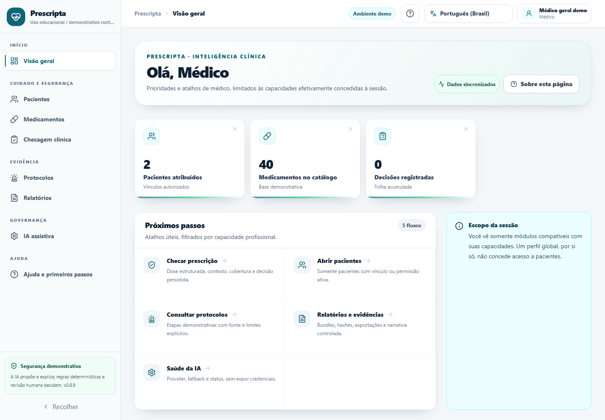 | 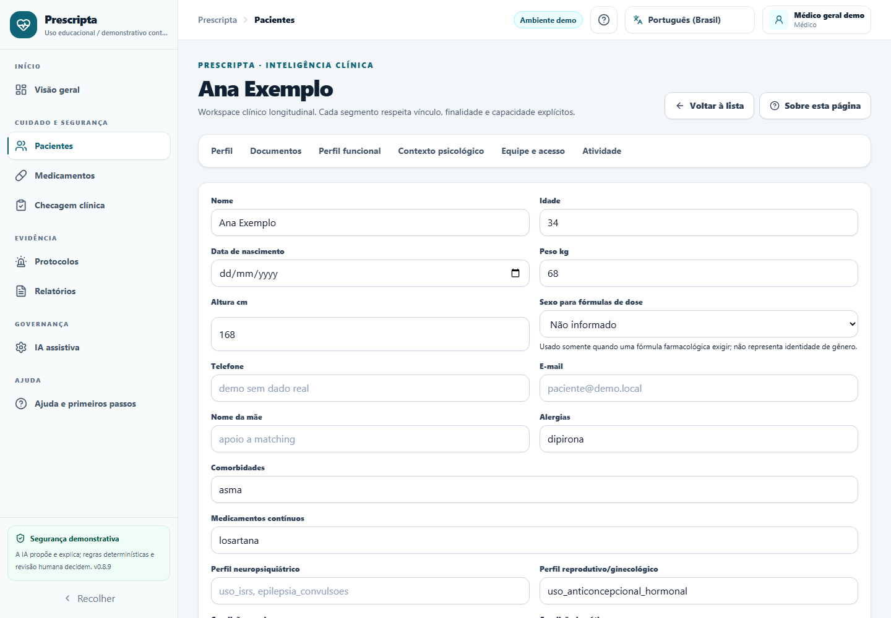 |
| Decisão clínica | Revisão farmacêutica |
| 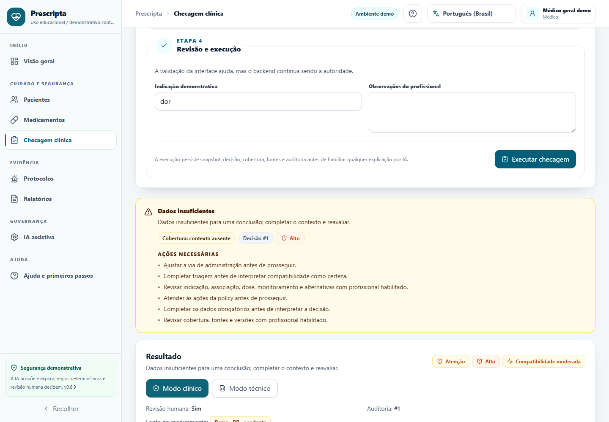 | 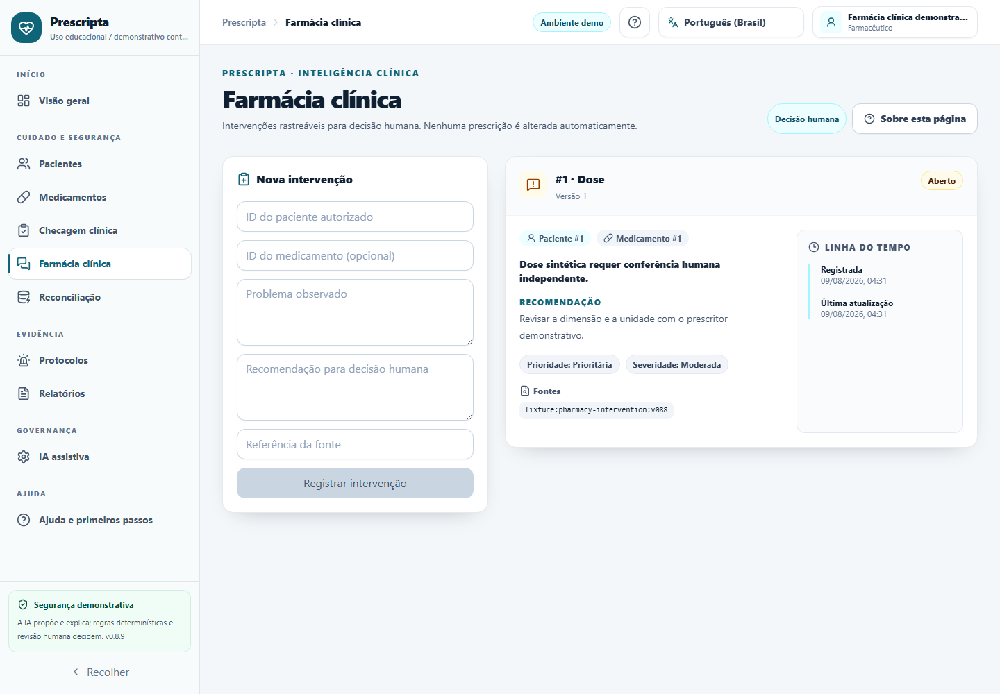 |

| Research Workspace | Attrition reproduzível |
| --- | --- |
| 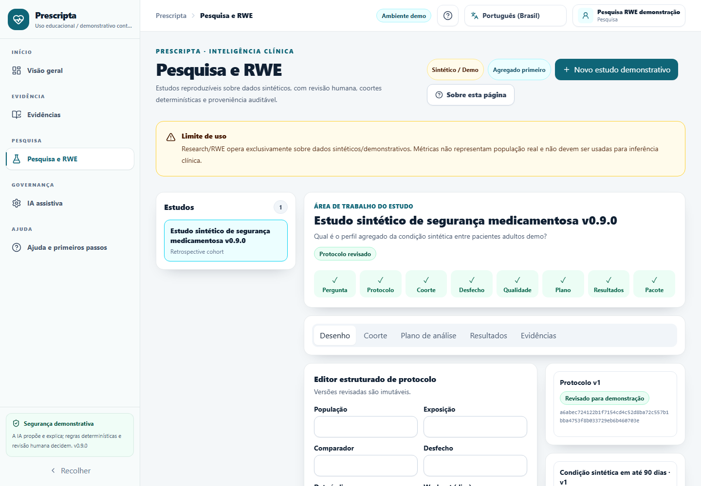 | 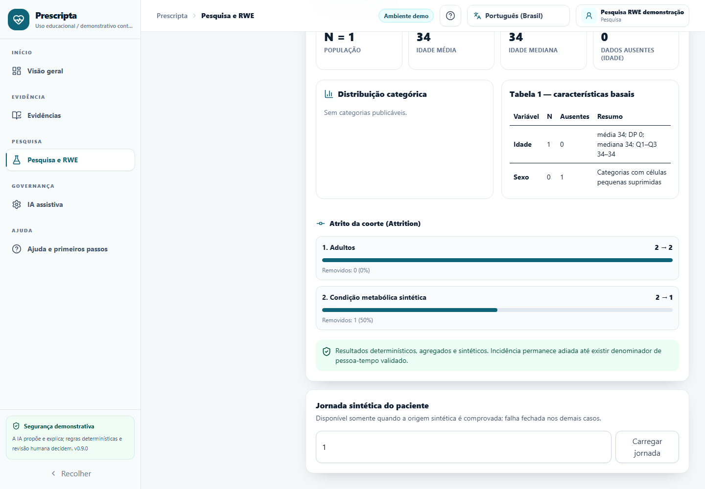 |

| Comparative RWE | PSM/IPTW experimentais |
| --- | --- |
| 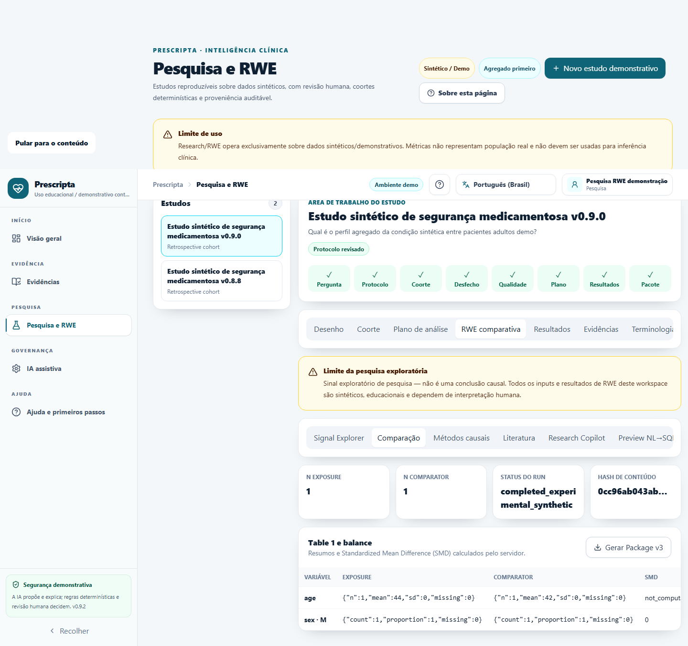 | 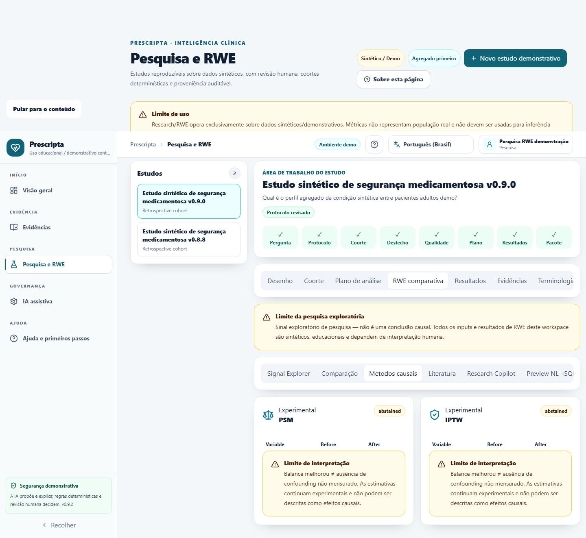 |

| Sensibilidade e evidência | Agente e planner governados |
| --- | --- |
| 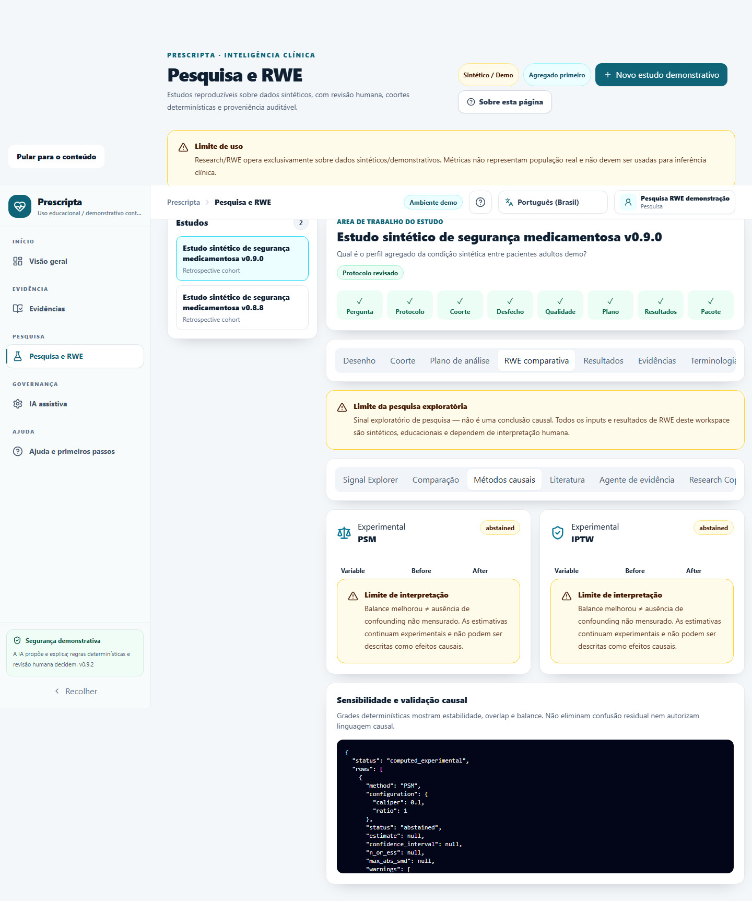 | 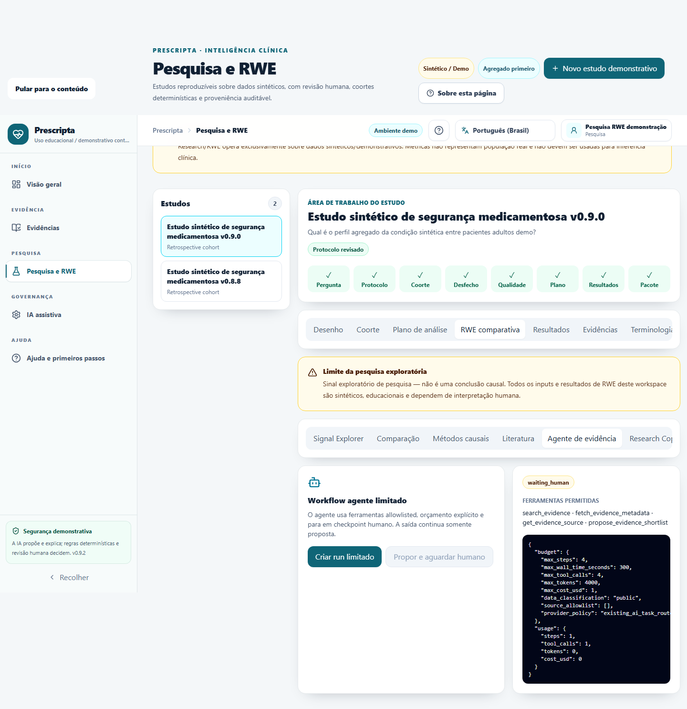 |

A [galeria corrente e seu manifesto SHA-256](docs/assets/current/manifest.json) também incluem checagem estruturada, auditoria e mobile.

## Quick Start A — Docker

Requer Docker com Compose v2. A stack inicia PostgreSQL, executa migrations e publica a interface em
`http://localhost:8080` e a API em `http://localhost:8000`.

```powershell
Copy-Item .env.example .env
docker compose up --build
```

Use `docker compose down` para parar preservando o volume. `docker compose down --volumes` também
remove todos os dados demonstrativos locais. Consulte o [guia Docker](docs/operations/docker.md).

## Quick Start B — desenvolvimento nativo

Requer Python 3.12+, Node.js 24+ e npm.

```powershell
python -m venv .venv
.\.venv\Scripts\python -m pip install -r backend\requirements.txt
.\.venv\Scripts\python -m pip install -r backend\requirements-dev.txt
cd frontend
npm ci
```

Copie `.env.example` para `.env` e mantenha o modo local enquanto usar SQLite, auto-seed e
credenciais demonstrativas. Em terminais separados:

```powershell
powershell -ExecutionPolicy Bypass -File scripts/dev.ps1
```

Ou consulte o [guia de setup local](docs/getting-started/local-setup.md). Docker complementa esse
fluxo; não substitui o ambiente Python/Node útil durante desenvolvimento.

## Arquitetura resumida

```text
React/TypeScript
      │ cookie HttpOnly + contratos tipados
FastAPI routes ── autorização por papel, instituição e objeto
      │
serviços de aplicação ─┬─ Medication Safety determinística
      │                ├─ Research/RWE aggregate-first
      │                └─ Evidence + AI Task Router controlado
SQLAlchemy/Alembic ── JSON canônico, snapshots, provenance e auditoria
      │
PostgreSQL (produção alvo) / SQLite somente local-demo
```

Regras clínicas não ficam nas rotas nem no frontend. Uma checagem persiste decisão, eventos e snapshot
na mesma transação. Relatórios de prescrição leem apenas esse snapshot e verificam seu hash.

## Modo demo

O modo local cria dados artificiais quando `PRESCRIPTA_AUTO_SEED=true`. Credenciais demonstrativas,
SQLite, CORS local e o segredo padrão são rejeitados em ambientes não locais. O catálogo e as regras
seed permanecem marcados como `demo` ou `pending_review`; ausência de cobertura nunca aparece como
resultado favorável.

## Segurança e privacidade

- não versione `.env`, banco local, chaves, caches, `node_modules` ou `dist`;
- não envie CPF, CNS, contato, endereço ou identificadores reais a providers externos;
- nomes e e-mails não são copiados para novos eventos de auditoria;
- pseudonimização não é anonimização e continua sujeita a controle de acesso e retenção;
- produção exige PostgreSQL, segredo forte, auto-seed desligado, CORS explícito e chave de criptografia;
- vulnerabilidades devem seguir [SECURITY.md](SECURITY.md), não uma issue pública.

O [modelo de ameaça](docs/security/threat-model.md), o
[hazard log clínico](docs/security/clinical-safety-hazard-log.md) e os
[riscos aceitos](docs/security/accepted-risks.md) registram controles e risco residual.

## Documentação

- [índice da documentação](docs/README.md)
- [guia do usuário por rota](docs/user-guide/README.md)
- [arquitetura](docs/architecture/overview.md)
- [roadmap v0.9.3–v1.0](docs/ROADMAP.md)
- [regras clínicas](docs/clinical-rules/risk-engine.md)
- [Research & RWE](docs/research/README.md) e [Evidence Intelligence](docs/evidence/README.md)
- [interoperabilidade](docs/interoperability/architecture.md)
- [IA](docs/ai/multi-provider-ai.md) e [busca lexical](docs/rag/clinical-rag.md)
- [frontend e i18n](docs/frontend/architecture.md), [testes](docs/testing/ci-and-release-gates.md) e [operações](docs/operations/README.md)
- [auditorias históricas](docs/audits/README.md), [changelog](CHANGELOG.md) e
  [índice de releases](docs/releases/README.md)

## Testes

```powershell
cd backend
..\.venv\Scripts\python -m ruff check . --no-cache
..\.venv\Scripts\python -m pytest
cd ..\frontend
npm run lint
npm run typecheck
npm run test:coverage
npm run build
npm run test:e2e
cd ..
python scripts/check_assets.py
```

Os gates completos estão em `.github/workflows/ci.yml`, `.github/workflows/security.yml` e nos scripts
`scripts/check_*.py`.

## Licença

[Apache License 2.0](LICENSE). Fontes, padrões e projetos usados apenas como benchmark mantêm suas
próprias licenças; nenhum claim de conformidade é derivado deles.
