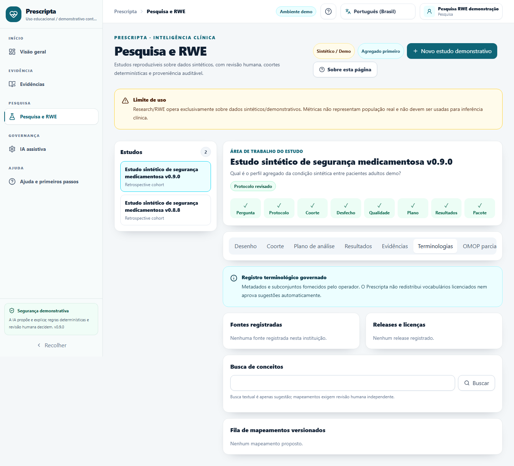
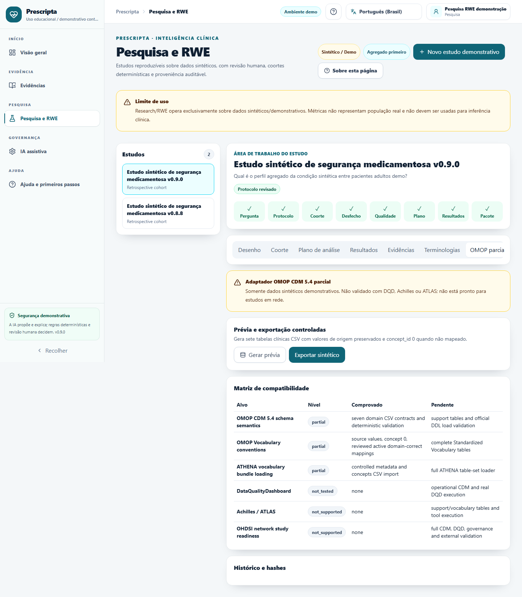

# Prescripta v0.9.1 — Terminology & OMOP

Release sintético/demonstrativo. Não possui validação clínica, causal, regulatória, OMOP completa ou
de real-world evidence.

## Destaques

- registro institucional de fontes, releases, licença, checksum e proveniência;
- import controlado de subsets CSV/ZIP-CSV, busca bounded e drift entre releases;
- mappings versionados com revisão humana independente e falha fechada;
- Data Quality, outcomes, planos e pacotes vinculados aos runs/versões exatos;
- Research Package v2 agregado, verificável e com lineage terminológico/OMOP;
- adapter parcial OMOP CDM 5.4 para sete tabelas clínicas e dados somente sintéticos;
- UI PT-BR/EN-US com matriz de compatibilidade e RBAC;
- npm 11.18.0 pinado, install scripts allowlisted e SBOMs de dependências/imagens no workflow.

## Limitações honestas

- DQD não foi executado; Achilles e ATLAS não são suportados;
- não há bundle Athena/full Standardized Vocabularies;
- não há conteúdo completo de SNOMED CT, LOINC, RxNorm, ICD ou ATC no repositório/release;
- não é OMOP network-ready, não é integração hospitalar e não processa dados reais neste fluxo;
- hashes fornecem integridade reprodutível, não assinatura externa ou WORM.

Consulte a [arquitetura/licenças](../architecture/terminology-and-omop-v091.md), a
[matriz de fechamento](../audits/v0.9.1-implementation-closure-matrix.md) e o
[pacote reproduzível](../research/reproducible-package-v091.md).

## Validação

- backend: 235 testes, 82,45% de cobertura combinada e 65,15% de branches;
- frontend: 84 testes, 82,83% statements, 70,67% branches, 79,09% functions e 84,70% lines;
- E2E: 19 cenários executados com sucesso e 2 skips previstos pelos projetos responsivos;
- container smoke: PostgreSQL 17.10, migration/rerun, health/restart e runtimes não-root;
- 736 chaves i18n alinhadas; texto, links, assets, versão, install scripts e npm audit aprovados.

CI, Security, Container, tag e assets do GitHub devem ser verificados no commit final publicado;
resultados locais não são apresentados como aprovação externa.

## Evidência visual automatizada

| Governança terminológica | Compatibilidade OMOP parcial |
| --- | --- |
|  |  |

As capturas são de fixture sintética e automatizada; não constituem validação por usuário ou
aprovação clínica.
