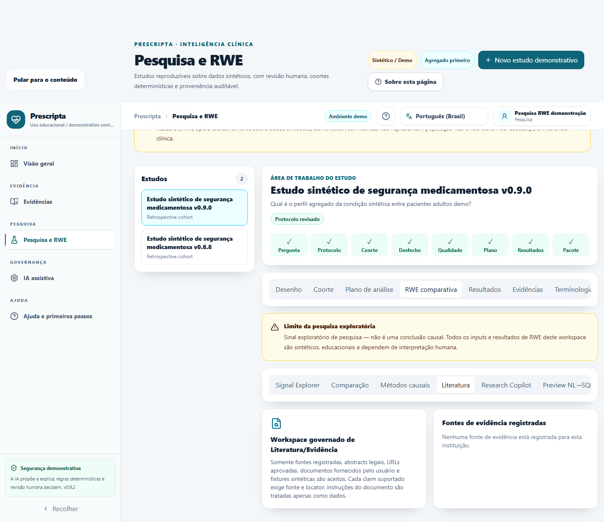
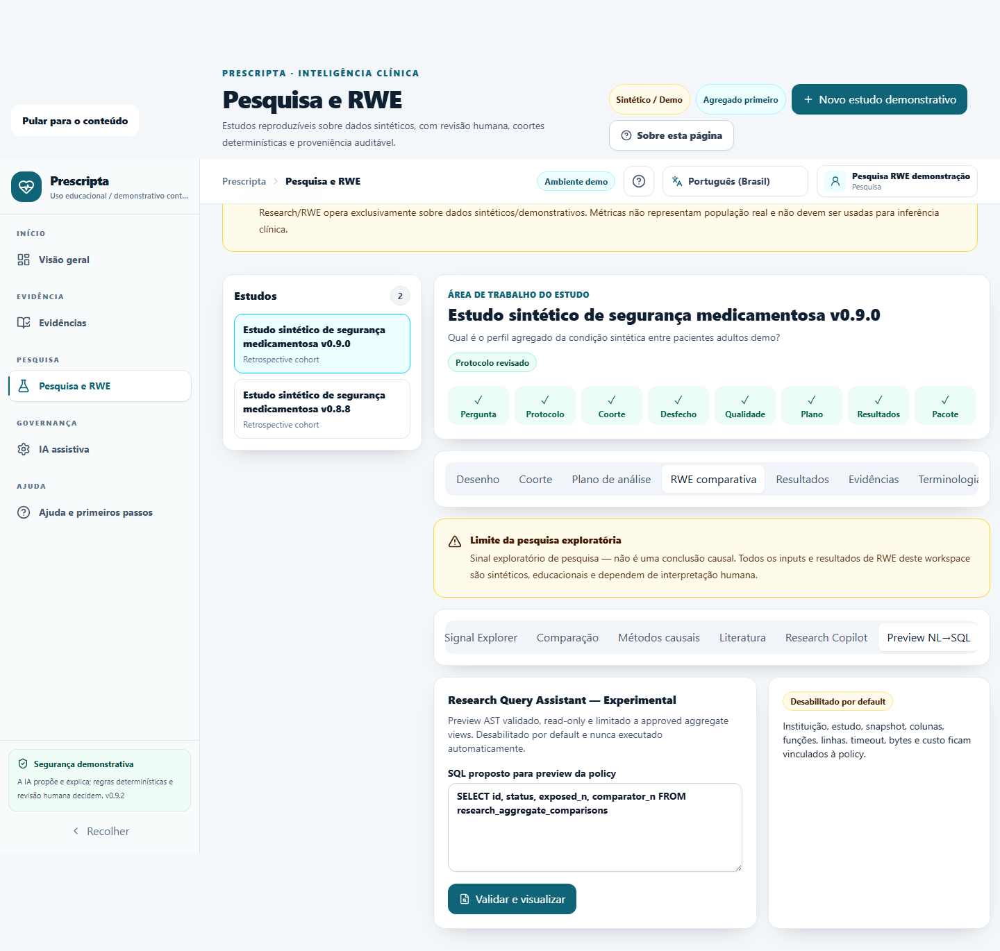

# Prescripta v0.9.2 — Research Copilot v2 & Comparative RWE

A v0.9.2 consolida a próxima vertical de Research no mesmo workspace: um achado auditado de
Medication Safety pode virar draft; dois cohort runs sintéticos podem ser comparados; e o pesquisador
recebe métodos determinísticos, evidência grounded e assistência proposal-only.

## Destaques

- Table 1, missingness, SMD, risco, diferença de risco, RR/OR/IC, pessoa-tempo e incidência;
- PSM/IPTW experimentais com estimand, overlap, balance, ESS, pesos extremos e abstention;
- Research Copilot v2 com roteamento governado, provenance e evals adversariais;
- Literature Copilot com fonte/locator e resistência a prompt injection;
- NL→SQL default-off, AST/read-only, uma view aggregate-only, escopo e budgets injetados;
- package v3 com referências exatas e sem linhas de paciente;
- PT-BR/EN-US e fluxos responsivos no Research Workspace.

## Limitações explícitas

Esta release é sintética, demonstrativa e educacional. Não é validada epidemiológica, clínica ou
regulatoriamente; não deve orientar cuidado. Associação não implica causalidade. PSM/IPTW aguardam
validação independente. IA propõe, o motor determinístico calcula e uma pessoa revisa.

Consulte a [matriz de fechamento](../audits/v0.9.2-implementation-closure-matrix.md), o
[relatório do RC](../audits/v0.9.2-release-candidate-quality-report.md) e os
[métodos](../research/statistical-methods.md).

## Evidência visual sintética

| Comparação e Table 1 | PSM/IPTW |
| --- | --- |
|  |  |
| Literature Workspace | NL→SQL default-off |
|  |  |

O [manifesto](../assets/v0.9.2/manifest.json) registra dimensão, bytes e SHA-256 das oito capturas
reais da aplicação sobre fixture sintética, incluindo Signal Explorer, Copilot, EN-US e mobile.
